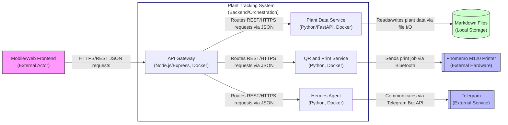

# Backend / Orchestration Container - C2 Diagram

This diagram shows the backend/orchestration layer of the Plant Tracking
System. It exposes a unified API gateway that routes requests to specialized
backend services for plant data management, QR code generation/printing, and
Hermes agent integration. The backend services interact with external systems
including Telegram (for Hermes agent communication) and the Phomemo M120
printer (for label printing), while persisting plant data to local markdown
files.

## Scope

**In Scope:**

- Backend orchestration via API Gateway
- Plant data storage and retrieval service
- QR code generation and label printing service
- Hermes agent integration service via Telegram
- External systems: Telegram Service and Phomemo M120 Printer
- Internal data storage: Local markdown files

**Out of Scope:**

- Frontend containers (Mobile App Frontend, Web Interface, QR Scanner, Photo

Capture)

- User interactions and device-level features (camera, GPS, etc.)
- Offline data synchronization and queueing (Post-MVP)
- Advanced analytics and predictive features (Post-MVP)

## Assumptions & Constraints

- The system assumes connectivity will be available in 2026 for Telegram and

printer interactions

- All backend services are containerized using Docker for consistent deployment
- REST over HTTPS is used for all internal service communications
- The Phomemo M120 printer is accessed via Bluetooth using Python libraries
- Data integrity is maintained through atomic file operations on markdown

storage

- API keys and secrets are injected via environment variables and encrypted at

rest

- The Hermes agent is accessed via Telegram Bot API; its internal workings are

treated as a black box

- Label printing failures trigger retry mechanisms with exponential backoff
- Hermes agent unavailability is handled via circuit breaker pattern with

fallback to cached responses

## Container Definitions

### Orchestrator (API Gateway)

**Primary Responsibility:** Exposes unified REST/HTTPS interface for frontend
clients, routes requests to appropriate backend services, handles cross-cutting
concerns (authentication, logging, rate limiting).
**Technology:** Node.js/Express, Docker
**Key APIs:**

- `GET /plants/{id}` - Retrieve plant record
- `POST /plants` - Create new plant record
- `PUT /plants/{id}` - Update plant record
- `GET /plants/{id}/qr` - Generate QR code for plant ID
- `POST /plants/{id}/print` - Trigger label print job
- `POST /hermes/query` - Send natural language query to Hermes agent

**Interfaces:**

- Receives HTTPS JSON requests from frontend (external)
- Sends internal REST/HTTPS JSON requests to Plant Data Service, QR and Print

Service, Hermes Agent
**Persistence:** None (stateless routing layer)

### Plant Data Service

**Primary Responsibility:** Manages CRUD operations for plant records stored in
local markdown files, provides search and filtering capabilities.
**Technology:** Python (FastAPI), Docker
**Key APIs:**

- `GET /internal/plants/{id}` - Retrieve plant record by ID
- `POST /internal/plants` - Create new plant record
- `PUT /internal/plants/{id}` - Update plant record
- `GET /internal/plants` - List/filter plant records (by date, variety,

location, etc.)

- `DELETE /internal/plants/{id}` - Delete plant record

**Interfaces:**

- Receives internal REST/HTTPS JSON requests from Orchestrator
- Sends file I/O operations to Markdown Data Storage

**Persistence:** Local markdown files in `/data/plants/` directory with
Frontmatter format:

  ```
  ---
  id: HABY-2026-001
  variety: Yellow Habanero
  latin_name: Capsicum chinense
  brand: Burpee
  planted_date: 2026-04-15
  ...
  ---
  ```

**Data Schema:** JSON Schema for plant records (see Appendix A)

### QR and Print Service

**Primary Responsibility:** Generates QR codes encoding plant IDs and manages
print jobs to the Phomemo M120 Bluetooth label printer.
**Technology:** Python, Docker
**Key APIs:**

- `GET /internal/qr/{plant_id}` - Generate QR code PNG for plant ID
- `POST /internal/print/{plant_id}` - Trigger print job for plant label

**Interfaces:**

- Receives internal REST/HTTPS JSON requests from Orchestrator
- Sends Bluetooth print commands to Phomemo M120 Printer
- Uses `qrcode` library for QR code generation

**Persistence:** None (temporary QR code images stored in `/tmp/` and cleaned
after print)
**Print Job Format:** ZPL-like commands via Bluetooth serial interface:

  ```
  ^XA^FO50,50^BQN,2,4^FDLA,HABY-2026-001^FS^XZ
  ```

### Hermes Agent

**Primary Responsibility:** Handles natural language querying and data analysis
by interacting with the Hermes agent via Telegram Bot API.
**Technology:** Python, Docker
**Key APIs:**

- `POST /internal/hermes/analyze` - Analyze plant data for insights
- `POST /internal/hermes/compare` - Compare two plant records
- `POST /internal/hermes/recommend` - Generate care recommendations

**Interfaces:**

- Receives internal REST/HTTPS JSON requests from Orchestrator
- Sends/receives messages via Telegram Bot API to Telegram Service
- Uses `python-telegram-bot` library for Telegram integration

**Persistence:** None (stateless; relies on Plant Data Service for plant
records)
**Telegram Format:** Messages formatted as:

  ```
  /analyze HABY-2026-001
  /compare JALP-2026-002 SERR-2026-001
  /recommend HABY-2026-001
  ```

### External Systems

#### Telegram Service

**Type:** External messaging platform
**Responsibility:** Provides messaging infrastructure for Hermes agent
integration
**Interface:** Telegram Bot API (HTTPS/JSON)
**Protocol:** HTTPS over TCP port 443
**Authentication:** Bot token via Authorization header

#### Phomemo M120 Printer

**Type:** External hardware device
**Responsibility:** Prints durable QR-coded labels for plant identification
**Interface:** Bluetooth Serial Port Profile (SPP)
**Protocol:** Bluetooth 4.0+ Serial Communication
**Data Format:** ESC/POS-like command sequences for label printing

### Internal Data Storage

#### Markdown Data Storage

**Type:** Local file system
**Responsibility:** Persists plant records in human-readable markdown format
**Interface:** File system I/O (read/write/append)
**Persistence:** Atomic file operations with file locking to prevent corruption
**Backup Strategy:** Manual export/import via Plant Data Service (FR16)
**Location:** `/data/plants/` directory mounted as volume in Docker container

## Relationship Details

### Orchestrator ↔ Plant Data Service

- **Label:** "Routes REST/HTTPS requests via JSON"
- **Technology:** HTTPS/REST over localhost:8001
- **Payload Schema:** PlantDataRequest/Response (see Appendix A)
- **Error Mapping:** 
  - 404 → PlantNotFoundException
  - 400 → ValidationException
  - 500 → InternalServiceException
- **Direction:** Bidirectional (request/response)

### Orchestrator ↔ QR and Print Service

- **Label:** "Routes REST/HTTPS requests via JSON"
- **Technology:** HTTPS/REST over localhost:8002
- **Payload Schema:** QRPrintRequest/Response (see Appendix B)
- **Error Mapping:**
  - 400 → InvalidPlantIDException
  - 503 → PrinterUnavailableException
  - 500 → PrintJobFailedException
- **Direction:** Bidirectional (request/response)

### Orchestrator ↔ Hermes Agent

- **Label:** "Routes REST/HTTPS requests via JSON"
- **Technology:** HTTPS/REST over localhost:8003
- **Payload Schema:** HermesRequest/Response (see Appendix C)
- **Error Mapping:**
  - 503 → HermesUnavailableException
  - 400 → InvalidQueryException
  - 500 → AnalysisFailedException
- **Direction:** Bidirectional (request/response)

### Plant Data Service ↔ Markdown Data Storage

- **Label:** "Reads/writes plant data via file I/O"
- **Technology:** Local file system access
- **Payload Schema:** Markdown Frontmatter + plain text observations
- **Error Mapping:**
  - ENOENT → PlantNotFoundException
  - EACCES → StorageAccessException
  - EIO → StorageCorruptionException
- **Direction:** Bidirectional (read/write)

### QR and Print Service ↔ Phomemo M120 Printer

- **Label:** "Sends print job via Bluetooth"
- **Technology:** Bluetooth SPP (Serial Port Profile)
- **Payload Schema:** ESC/POS-like command bytes
- **Error Mapping:**
  - BT_TIMEOUT → PrinterConnectionTimeoutException
  - BT_NOT_FOUND → PrinterNotFoundException
  - BT_FAILED → PrintTransmissionException
- **Direction:** Unidirectional (service to printer)

### Hermes Agent ↔ Telegram Service

- **Label:** "Communicates via Telegram Bot API"
- **Technology:** HTTPS/REST to api.telegram.org
- **Payload Schema:** Telegram Bot API JSON (sendMessage/getUpdates)
- **Error Mapping:**
  - 401 → InvalidBotTokenException
  - 429 → RateLimitExceededException
  - 502 → TelegramServiceUnavailableException
- **Direction:** Bidirectional (send/receive messages)

## Adversarial Edge Case Logging

### Network Partition (Telemeter/Hermes Unavailable)

- **Scope:** Falls under backend resilience (C2 scope)
- **Handling:** 
  - Circuit breaker pattern (Hystrix-inspired) with 5-second timeout
  - Fallback to cached analysis results for Hermes queries (max age 24h)
  - Queue print requests locally with retry (exponential backoff, max 5

  attempts)

  - Return 503 status with Retry-After header for transient failures
- **PRD Reference:** FR36-FR40 (Hermes Agent Integration), NFR2 (Reliability)

### Hardware Failure (Phomemo Offline)

- **Scope:** Falls under backend resilience (C2 scope)
- **Handling:**
  - Detect printer absence via Bluetooth discovery timeout (10s)
  - Queue print jobs in persistent storage (`/data/print_queue/`)
  - Retry every 30s with exponential backoff (max 10 attempts)
  - Notify user via Hermes agent when printer returns online
  - Allow manual print retry via API endpoint
- **PRD Reference:** FR3 (Print QR-coded labels), NFR2 (Reliability)

### Data Latency/Consistency (Markdown Storage)

- **Scope:** Falls under backend data integrity (C2 scope)
- **Handling:**
  - Atomic write operations using temporary files + rename
  - File locking (fcntl) to prevent concurrent writes
  - Read-after-write consistency for immediate data visibility
  - Background fsync every 5s to flush buffers
  - Corruption detection via file checksum on read
- **PRD Reference:** FR6-FR11 (Data Capture & Storage), NFR1 (Data Integrity)

### Rate Limiting (External Services)

- **Scope:** Falls under backend resilience (C2 scope)
- **Handling:**
  - Token bucket algorithm for Telegram API (1 msg/sec burst 5)
  - Request throttling for print jobs (max 2/min to prevent overheating)
  - Global rate limiter on Orchestrator (100 req/sec per IP)
  - Return 429 with Retry-After header when limits exceeded
- **PRD Reference:** NFR3 (Performance), NFR2 (Reliability)

### Credential Management

- **Scope:** Falls under backend security (C2 scope)
- **Handling:**
  - API keys/secrets injected via Docker secrets/environment variables
  - Encryption at rest using AES-256-GCM for sensitive config
  - Automatic rotation via sidecar tool (HashiCorp Vault agent)
  - No hardcoded credentials in source code or configs
  - Audit logging of credential access (no secret leakage)
- **PRD Reference:** NFR5 (Security & Credential Management)

## Diagram


