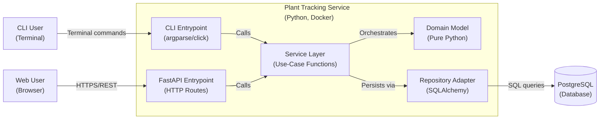

# Plant Tracking System — Backend Container Architecture

> **Updated per ADR-0008**: Ports & Adapters single-service architecture replacing microservices.

This diagram shows the backend architecture of the Plant Tracking System as a single Python service using the Ports & Adapters (Hexagonal Architecture) pattern. The service exposes two entrypoints — a CLI for garden-side operations and a FastAPI web server for the frontend UI — both calling the same shared service layer. Data is persisted to PostgreSQL via SQLAlchemy adapters.

## Scope

**In Scope:**

- Single Python service with layered internal architecture
- CLI entrypoint (argparse/click) for terminal-based operations
- FastAPI entrypoint for REST/HTTPS web API
- Shared service layer with use-case functions
- Domain model (pure Python, no infrastructure imports)
- SQLAlchemy adapter layer for PostgreSQL
- PostgreSQL database (external backing service)

**Out of Scope:**

- Frontend containers (Mobile App, Web Interface)
- Hermes agent integration via Telegram (separate service)
- Phomemo M120 printer integration (hardware peripheral)
- Pinecone vector store (deferred)

## Assumptions & Constraints

- Single bounded context: plants, logs, seed packets, genera
- Single developer maintenance model
- All entrypoints share the same service layer — zero business logic duplication
- Dependency arrows point inward: adapters import domain, domain never imports adapters
- PostgreSQL is the sole persistent data store
- API keys and secrets injected via environment variables
- Docker containerization for consistent deployment

## Container Definitions

### Plant Tracking Service

**Primary Responsibility:** Manages all plant tracking data — CRUD for plants, seed packets, genera, and care activity logs. Exposes operations via CLI and REST API.

**Technology:** Python 3.9+, FastAPI, SQLAlchemy, Alembic, Docker

**Internal Layer Structure:**

| Layer | Responsibility | Technology |
|---|---|---|
| CLI Entrypoint | Parse arguments, call service functions, print results | argparse/click |
| FastAPI Entrypoint | HTTP routes, request validation, JSON responses | FastAPI, Pydantic |
| Service Layer | Use-case orchestration: fetch → operate → persist | Pure Python functions |
| Domain Model | Business rules, validation, ID generation | Plain Python classes |
| Repository Adapter | SQLAlchemy ORM models, session management | SQLAlchemy 2.0 |
| Unit of Work | Transaction boundaries, commit/rollback | SQLAlchemy Session |

**Key APIs (FastAPI):**

- `GET /` — Root endpoint
- `GET /health` — Health check
- `GET /api/plants/care-needed` — Plants needing care attention (returns mock data; threshold logic pending)
- `POST /api/media/media-attachments/` — Create media attachment (multipart file upload)
- `GET /api/media/media-attachments/{media_id}` — Get media attachment by ID
- `PUT /api/media/media-attachments/{media_id}` — Update media attachment metadata
- `DELETE /api/media/media-attachments/{media_id}` — Delete media attachment
- `GET /api/media/media-attachments/plant/{plant_id}` — Get all media attachments for a plant
- `GET /api/media/media-attachments/{media_id}/url` — Get presigned S3 URL for media

**OpenAPI Export:**

- `scripts/export_openapi.py` — Exports OpenAPI 3.1 spec to `openapi.json` without running the server
- Exported spec consumed by Orval to generate TypeScript API client stubs for the frontend

**CLI Commands:**

- `plant add-plant` — Create new plant record
- `plant list-plants` — List all plants with filters
- `plant add-log` — Record care activity
- `plant list-logs` — View care activity history
- `plant add-seed-packet` — Create seed packet record
- `plant add-genus` — Create genus record
- `plant export` — Export data to markdown/JSON

**Interfaces:**

- Receives HTTP JSON requests from web frontend (FastAPI)
- Receives terminal commands from CLI user
- Executes SQL queries against PostgreSQL via SQLAlchemy

**Persistence:** PostgreSQL database via SQLAlchemy ORM with Alembic migrations

### External Systems

#### PostgreSQL Database

**Type:** External backing service (12-Factor IV)
**Responsibility:** Primary relational data store with ACID compliance
**Interface:** PostgreSQL wire protocol (libpq/TCP)
**Protocol:** TCP port 5432
**Authentication:** Username/password via `DATABASE_URL` environment variable

## Layer Details

### Service Layer

Service functions are the single source of truth for business operations. Both CLI and FastAPI call the same functions:

```python
# Example service function
def create_plant(
    variety_name: str,
    latin_name: str,
    planting_date: str,
    uow: AbstractUnitOfWork,
) -> str:
    """Use case: register a new plant in the garden."""
    with uow:
        # Domain validation
        plant = Plant.create_from_dict({
            "variety_name": variety_name,
            "latin_name": latin_name,
            "planting_date": planting_date,
        })
        uow.plants.add(plant)
        uow.commit()
    return plant.id
```

### Domain Model

Pure Python classes with no infrastructure imports:

```python
# domain/plant.py — no SQLAlchemy, no database, no HTTP
class Plant:
    def __init__(self, id: str, variety_name: str, latin_name: str, ...):
        ...
    
    @classmethod
    def create_from_dict(cls, data: dict) -> "Plant":
        # Validation, ID generation — pure logic
        ...
```

### Repository Pattern

Domain defines Protocol interfaces; adapters provide implementations:

```python
# Domain defines the port
class AbstractPlantRepository(Protocol):
    def add(self, plant: Plant) -> None: ...
    def get(self, id: str) -> Plant | None: ...
    def list(self, filters: dict) -> list[Plant]: ...

# Adapter implements it
class SqlAlchemyPlantRepository:
    def __init__(self, session: Session) -> None: ...
    def add(self, plant: Plant) -> None: ...
    def get(self, id: str) -> Plant | None: ...
```

## Relationship Details

### CLI Entrypoint → Service Layer

- **Label:** "Calls service functions with parsed arguments"
- **Technology:** In-process Python function calls
- **Payload:** Primitive types (str, int, date)
- **Error Mapping:** Service exceptions → CLI exit codes + stderr messages

### FastAPI Entrypoint → Service Layer

- **Label:** "Calls service functions with validated request data"
- **Technology:** In-process Python function calls
- **Payload:** Pydantic models → dict → service function arguments
- **Error Mapping:**
  - 404 → PlantNotFoundException
  - 400 → ValidationException
  - 500 → InternalServiceException

### Service Layer → Domain Model

- **Label:** "Invokes domain operations"
- **Technology:** In-process Python method calls
- **Payload:** Domain objects and primitives
- **Direction:** Unidirectional (service → domain)

### Service Layer → Repository Adapter

- **Label:** "Persists and retrieves domain objects"
- **Technology:** Protocol interface (AbstractUnitOfWork)
- **Payload:** Domain objects
- **Direction:** Bidirectional (service calls repo, repo returns domain objects)

### Repository Adapter → PostgreSQL

- **Label:** "Executes SQL queries"
- **Technology:** SQLAlchemy ORM / Core
- **Payload:** SQL statements, result sets
- **Error Mapping:**
  - IntegrityError → DuplicateKeyException
  - OperationalError → DatabaseConnectionException
  - InterfaceError → DatabaseDriverException

## Adversarial Edge Case Logging

### Database Connection Failure

- **Scope:** Adapter layer resilience
- **Handling:**
  - `pool_pre_ping=True` detects stale connections before use
  - Connection timeout with configurable retry (max 3 attempts)
  - Service functions raise `DatabaseUnavailableError` with descriptive message
  - CLI prints error to stderr, FastAPI returns 503
- **PRD Reference:** NFR-RELI-01

### Concurrent Write Conflict

- **Scope:** Domain consistency
- **Handling:**
  - SQLAlchemy session isolation (READ COMMITTED default)
  - Application-level locking for ID generation (sequence lookup)
  - Optimistic concurrency for future aggregate updates
- **PRD Reference:** NFR-RELI-01

### Data Export Failure (Markdown)

- **Scope:** Backup resilience
- **Handling:**
  - Atomic file writes (write to temp file, then rename)
  - Per-file error isolation — one failed export doesn't abort the batch
  - Export directory timestamped for rollback capability
- **PRD Reference:** NFR-DATA-02

## Diagram


