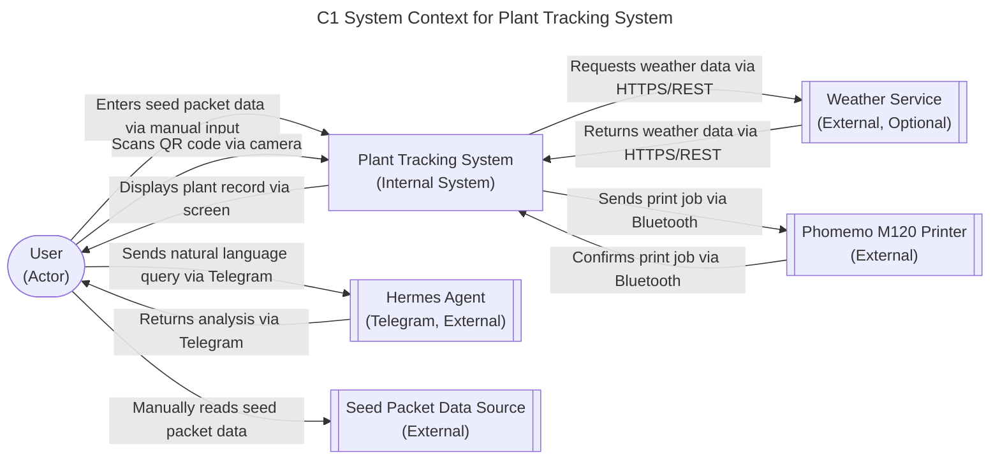

# Plant Tracking System - C1 System Context

## 1. Scope
The System Context diagram shows the Plant Tracking System in relation to its users and external systems. It defines the boundaries of the system and what it interacts with, without showing internal details.

## 2. Assumptions & Constraints
- The system is designed for home gardeners tracking individual plants.
- MVP relies on manual data entry for seed packet information and care activities.
- Hermes agent integration is via Telegram for natural language querying and analysis.
- Label printing uses the Phomemo M120 Bluetooth printer.
- Weather service integration is optional and uses HTTPS/REST.
- The system assumes connectivity for QR code scanning, Hermes agent, and weather service (though offline handling is deferred to later sprints).

## 3. Component Definitions
- User: The home gardener who interacts with the system (PRD FR41-FR45, FR1-FR5 for labeling and data capture).
- Plant Tracking System: The core system that stores plant records, processes QR scans, and integrates with external agents (PRD FR6-FR40, FR46-FR50).
- Hermes Agent (Telegram): External AI agent providing natural language querying, data analysis, and insights (PRD FR36-FR40).
- Phomemo M120 Printer: External Bluetooth label printer for generating QR-coded plant labels (PRD FR3, FR51-FR55).
- Seed Packet Data Source: External source of seed packet information (variety, planting details, etc.) that the user reads manually (PRD FR6).
- Weather Service: Optional external service providing weather data for environmental tracking (PRD FR25-FR26, FR31-FR33).

## 4. Adversarial Edge Case Logging
- Network Partition: This falls out of C1 scope (deferred to C2 or later). The system will queue operations locally and sync on reconnect.
- Hardware Failure — Phomemo Offline: This falls out of C1 scope (deferred to C2 or later). No automatic queuing is implemented in MVP; user must reprint when printer is back online.
- Data Latency/Consistency: This falls in C1 scope (accepted as manual process). Users may experience delays in data entry or retrieval, but the system ensures data integrity once entered.

## Diagram
