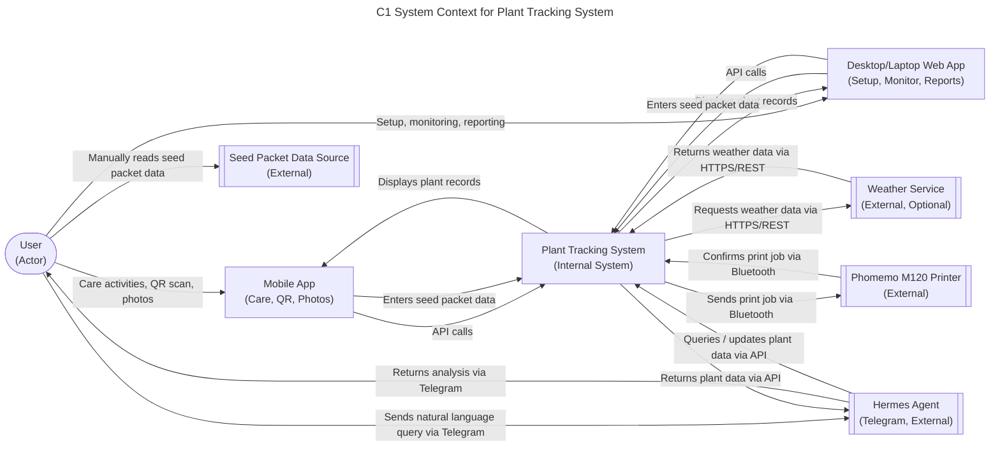

# Plant Tracking System - C1 System Context

## 1. Scope
The System Context diagram shows the Plant Tracking System in relation to its users and external systems. It defines the boundaries of the system and what it interacts with, without showing internal details.

## 2. Assumptions & Constraints
- The system is designed for home gardeners tracking individual plants.
- Users interact via two client platforms: a **mobile app** (used in the garden for care activities, QR scanning, photo capture) and a **desktop/laptop web app** (used for initial setup, monitoring, reporting, and data management). All core operations are available on both platforms.
- MVP relies on manual data entry for seed packet information and care activities.
- Hermes agent integrates via Telegram for natural language querying and analysis, and **communicates directly with the Plant Tracking System** to fetch data or make changes on the user's behalf.
- Label printing uses the Phomemo M120 Bluetooth/USB printer.
- Weather service integration is optional and uses HTTPS/REST.
- The system assumes connectivity for QR code scanning, Hermes agent, and weather service (though offline handling is deferred to later sprints).

## 3. Component Definitions
- User: The home gardener who interacts with the system through mobile and desktop clients (PRD FR41-FR45, FR1-FR5 for labeling and data capture).
- Mobile App: Client application used in the garden for care activities — QR scanning, photo capture, adding care notes, recording observations (PRD FR41-FR45).
- Desktop/Laptop Web App: Client application used for initial setup, monitoring, reporting, data management, and label generation. All core operations are available here and on mobile (PRD FR41-FR45).
- Plant Tracking System: The core system that stores plant records, processes QR scans, serves data to clients, and integrates with external agents via API (PRD FR6-FR40, FR46-FR50).
- Hermes Agent (Telegram): External AI agent providing natural language querying, data analysis, and insights. Communicates directly with the Plant Tracking System to fetch data or make changes on the user's behalf (PRD FR36-FR40).
- Phomemo M120 Printer: External Bluetooth label printer for generating QR-coded plant labels (PRD FR3, FR51-FR55).
- Seed Packet Data Source: External source of seed packet information (variety, planting details, etc.) that the user reads manually (PRD FR6).
- Weather Service: Optional external service providing weather data for environmental tracking (PRD FR25-FR26, FR31-FR33).

## 4. Adversarial Edge Case Logging
- Network Partition: This falls out of C1 scope (deferred to C2 or later). The system will queue operations locally and sync on reconnect.
- Hardware Failure — Phomemo Offline: This falls out of C1 scope (deferred to C2 or later). No automatic queuing is implemented in MVP; user must reprint when printer is back online.
- Data Latency/Consistency: This falls in C1 scope (accepted as manual process). Users may experience delays in data entry or retrieval, but the system ensures data integrity once entered.

## Diagram
