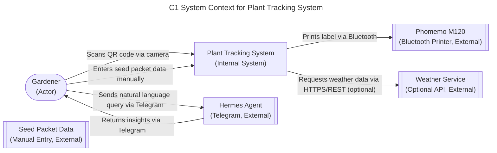

# Plant Tracking System - C1 System Context

## 1. Scope
The Plant Tracking System enables home gardeners to track individual plants using QR-coded labels and derive actionable insights through natural language interaction with the Hermes agent via Telegram. The system captures seed packet data, care activities, environmental conditions, and plant observations, storing them in a local markdown database for retrieval and analysis.

## 2. Assumptions & Constraints
- Users have access to a Phomemo M120 Bluetooth label printer for printing QR-coded labels.
- Seed packet data is manually entered by the user (no automated image extraction in MVP).
- The Hermes agent is accessed exclusively via Telegram for natural language querying and analysis.
- Weather service integration is optional and relies on publicly available APIs (e.g., OpenWeatherMap).
- Network connectivity is assumed for QR code scanning, Telegram interactions, and weather data retrieval; offline behavior is deferred to later sprints.
- Data integrity is maintained through local markdown storage with manual backup capabilities.

## 3. Component Definitions
- **User**: Home gardener who interacts with the system via QR scanning, Telegram, and manual data entry (maps to FR12, FR13, FR14, FR15, FR16, FR36, FR37, FR38, FR39, FR40, FR41, FR42, FR43, FR44, FR45).
- **Plant Tracking System**: Core application that manages plant records, processes QR scans, stores data in markdown files, and interfaces with external components (maps to FR1–FR11, FR16–FR21, FR31–FR35).
- **Hermes Agent (Telegram)**: External AI agent accessible via Telegram that provides natural language querying, data analysis, and personalized care recommendations (maps to FR36–FR40).
- **Phomemo M120 Printer**: External Bluetooth label printer used to generate durable QR-coded labels for plant identification (maps to FR3, FR51–FR55).
- **Seed Packet Data Source**: External physical/input source providing variety name, Latin name, brand, days to maturity, germination time, planting depth, spacing, sun requirements, and indoor start time (maps to FR6).
- **Weather Service (Optional)**: External API service providing temperature, humidity, rainfall, and other environmental data for microclimate tracking (maps to FR25–FR26, conditional).

## 4. Adversarial Edge Case Logging
- **Network Partition**: If connectivity is lost, QR scanning and Telegram interactions fail locally; data entry is queued for later sync. This falls out of C1 scope (deferred to C2 or later).
- **Hardware Failure — Phomemo Offline**: If the printer is unavailable, label generation is deferred until reconnection; no automatic queuing is implemented in MVP. This falls out of C1 scope (deferred to C2 or later).
- **Data Latency/Consistency**: Manual data entry may cause delays between observation and record updates; no conflict resolution is needed as the system is single-user. This falls in C1 scope (accepted as manual process).

## C1 System Context Diagram
