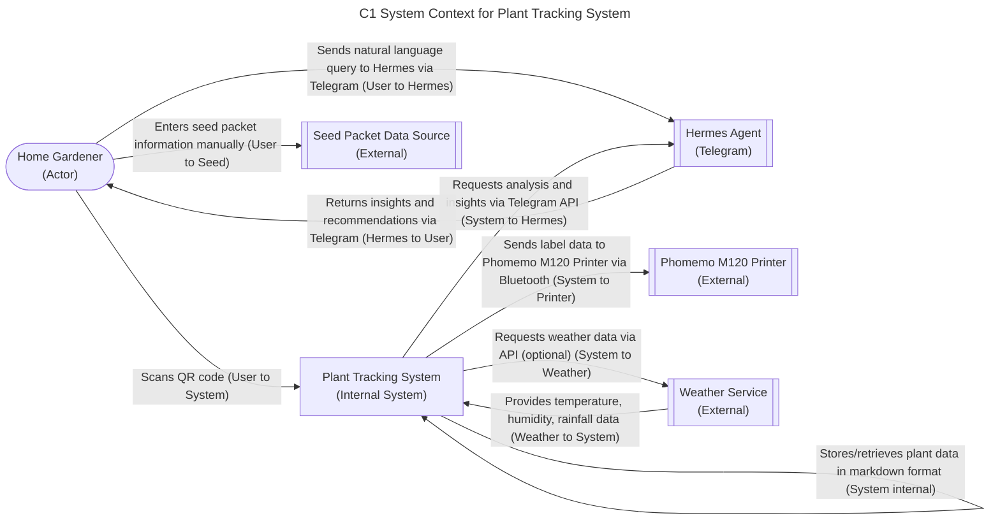

# C1 System Context for Plant Tracking System

## 1. Scope

This diagram shows the system context for the Plant Tracking System.
It displays the core entities and their interactions.
The system enables home gardeners to track individual plants using
QR-coded labels and derive insights via the Hermes agent.
Key components include:
- the user
- the plant tracking system itself
- the Hermes agent for natural language queries
- the Phomemo M120 printer for label generation
- seed packets as the initial data source
- an optional weather service for environmental data

## 2. Assumptions & Constraints

- The system assumes connectivity is available in 2026 for QR code
  scanning and Hermes agent interactions.
- Label printing relies on the Phomemo M120 Bluetooth printer;
  offline printing is not supported.
- Seed packet data is manually entered by the user; no automated
  extraction from images is implemented in MVP.
- Weather service integration is optional and considered supplementary
  for enhanced environmental tracking.
- The Hermes agent is accessed via Telegram for natural language
  querying and analysis.
- Data integrity is maintained through local markdown storage with
  manual backup capabilities.

## 3. Component Definitions

- User (Home Gardener): The individual using the system to track
  plants, scan QR codes, and interact with the Hermes agent via
  Telegram. Maps to FR12, FR13, FR14, FR15, FR16, FR36, FR37, FR38,
  FR39, FR40, FR41, FR42, FR43, FR44, FR45.
- Plant Tracking System: The core application that stores plant
  records in markdown format, retrieves records via QR code scan,
  and interfaces with the Hermes agent for analysis. Maps to FR1,
  FR2, FR3, FR4, FR5, FR6, FR7, FR8, FR9, FR10, FR11, FR12, FR13,
  FR14, FR15, FR16, FR17, FR18, FR19, FR20, FR21, FR22, FR23, FR24,
  FR25, FR26, FR27, FR28, FR29, FR30, FR31, FR32, FR33, FR34, FR35.
- Hermes Agent (Telegram): An AI agent accessible via Telegram that
  provides natural language querying, data analysis, and insights
  based on plant records. Maps to FR36, FR37, FR38, FR39, FR40.
- Phomemo M120 Printer: A Bluetooth label printer used to generate
  weather-resistant QR-coded labels for attachment to plants. Maps to
  FR3, FR51, FR52, FR53, FR54, FR55.
- Seed Packet Data Source: Physical seed packets providing initial
  plant variety information (name, Latin name, days to maturity, etc.)
  used to create plant records. Maps to FR6.
- Weather Service: An optional external service providing temperature,
  humidity, and rainfall data to enrich plant care records. Maps to
  FR25, FR26.

## 4. Adversarial Edge Case Logging

- Network Partition: QR code scanning fails without connectivity;
  Hermes agent queries return cached or error responses; weather data
  updates are delayed. Bluetooth printing to Phomemo M120 remains
  functional offline. Label data is queued locally for sync upon
  reconnection.
- Hardware Failure (Phomemo Offline): Label printing fails; user must
  manually write plant ID on temporary label or delay labeling until
  printer is reconnected. No automatic queuing is implemented in MVP.
- Data Latency/Consistency: Local markdown stores are immediately
  consistent. External data (weather, Hermes) may experience delays;
  last-write-wins conflict resolution is used for reconciliation.

## C1 System Context Diagram

### Relationship Descriptions

- User scans QR code to retrieve plant record: The user initiates a
  QR code scan using their mobile device camera, which triggers the
  Plant Tracking System to fetch and display the corresponding plant
  record from local storage.
- User sends natural language query to Hermes agent via Telegram: The
  user interacts with the Hermes agent through Telegram, sending
  queries like "analyze HABY-2026-001 for leaf yellowing causes" to
  receive data-driven insights.
- User enters seed packet information manually: The user inputs data
  from seed packets (variety name, Latin name, brand, days to maturity,
  etc.) into the Plant Tracking System to create a new plant record.
- System stores/retrieves plant data in markdown format: The Plant
  Tracking System persists plant records as structured markdown files
  and reads them to fulfill data retrieval requests.
- System requests analysis and insights via Telegram API: The Plant
  Tracking System forwards user queries or analysis requests to the
  Hermes agent via the Telegram Bot API.
- System sends label data to Phomemo M120 Printer via Bluetooth: The
  system transmits label content (variety name, QR code, planting info)
  to the Phomemo M120 printer over a Bluetooth connection for physical
  label production.
- System requests weather data via API (optional): The system
  optionally polls an external weather service to enrich plant care
  records with environmental data such as temperature and precipitation.
- Hermes returns insights and recommendations via Telegram: The Hermes
  agent processes queries and returns analytical insights, patterns, or
  care recommendations to the user through Telegram.
- Weather service provides temperature, humidity, rainfall data: The
  external weather service supplies environmental metrics that can be
  correlated with plant care activities and outcomes.
