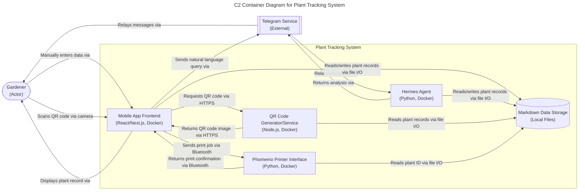

# Plant Tracking System - C2 Container Overview

## Container Narratives

### Gardener (Person)
**Primary Responsibility**: The gardener interacts with the system to track plants, scan QR codes, enter data, and receive insights through natural language queries. They represent the end-user who performs all plant care activities and data collection in the garden environment. (PRD FR41-FR45)
**Input Data/Triggers**: The gardener provides manual inputs including seed packet information, care activities (watering, fertilizing), environmental observations, and natural language queries to the Hermes agent. They trigger actions by scanning QR codes or initiating conversations via Telegram. (PRD FR6, FR8, FR13, FR36)
**Output/Downstream Effects**: The gardener receives plant records after QR scans, gets analysis and insights from the Hermes agent, and confirms label printing operations. Their interactions update the plant database with new care data and observations. (PRD FR12, FR17, FR20, FR54)
**Failure/Graceful Degradation**: If the gardener cannot scan QR codes due to lighting or damage, they can manually enter plant IDs. If Telegram/Hermes is unavailable, they can still record data locally and query later when connectivity restores. (PRD NFR2, NFR5)

### Hermes Agent
**Primary Responsibility**: Provides natural language querying, data analysis, and personalized insights for plant care decisions. Processes gardener requests via Telegram to analyze plant data, compare growth patterns, and recommend care adjustments. (PRD FR36-FR40)
**Input Data/Triggers**: Receives natural language queries from gardeners via Telegram containing plant IDs and analysis requests (e.g., "analyze HABY-2026-001 for leaf yellowing"). Also receives plant data updates when gardeners modify records through other interfaces. (PRD FR13, FR37, FR38)
**Output/Downstream Effects**: Returns structured insights, analysis results, and care recommendations to gardeners via Telegram messages. Provides comparative analysis between plants and predictive insights based on historical data patterns. (PRD FR17, FR18, FR20, FR21)
**Failure/Graceful Degradation**: If Telegram/Hermes service is unavailable, the system continues to accept and store data locally. Gardeners can still access plant records via QR scanning but must wait for service restoration to receive AI-powered insights. (PRD NFR5)

### Telegram Service
**Primary Responsibility**: Facilitates communication between gardeners and the Hermes agent for natural language interactions. Handles message delivery, notifications, and maintains the conversational interface for AI-powered plant care assistance. (PRD FR36)
**Input Data/Triggers**: Receives messages from gardeners containing plant care queries, analysis requests, and observational notes. Also receives outgoing messages from the Hermes agent containing insights and recommendations. (PRD FR13, FR36)
**Output/Downstream Effects**: Delivers messages between gardeners and Hermes agent in real-time, enabling conversational plant care advisory. Provides notification capabilities for care reminders and analysis completion alerts. (PRD FR20, FR37)
**Failure/Graceful Degradation**: If Telegram service experiences downtime, messages are queued and delivered upon restoration. The system indicates when Hermes agent is unavailable and allows local data entry to continue uninterrupted. (PRD NFR4)

### Mobile App Frontend
**Primary Responsibility**: Provides the user interface for gardeners to interact with the plant tracking system on mobile devices. Enables QR code scanning, photo capture, data entry, and plant record viewing through an intuitive touch-optimized interface. (PRD FR41-FR45)
**Input Data/Triggers**: Receives touch inputs from gardeners including QR scan triggers, photo capture commands, data entry forms, and navigation requests. Also receives updated plant data from backend services for display. (PRD FR42, FR43, FR44, FR9)
**Output/Downstream Effects**: Displays plant records after QR scans, shows camera interfaces for photo capture, presents data entry forms for care activities, and renders analytics dashboards. Sends user inputs to backend services for processing and storage. (PRD FR12, FR9, FR8, FR10)
**Failure/Graceful Degradation**: If network connectivity is lost, the app continues to function for offline data entry and QR scanning (caching results locally). Data synchronizes with backend when connectivity restores. Interface remains usable in varying outdoor light conditions. (PRD NFR1, NFR3)

### Phomemo Printer Interface
**Primary Responsibility**: Manages communication with the Phomemo M120 Bluetooth label printer for generating and printing QR-coded plant labels. Handles print job formatting, transmission, and confirmation of successful label output. (PRD FR3, FR51-FR55)
**Input Data/Triggers**: Receives print requests containing plant ID, variety name, Latin name, and planting date information from the QR code generation service. Also receives printer status updates and error notifications from the Bluetooth connection. (PRD FR2, FR51)
**Output/Downstream Effects**: Sends formatted print jobs to the Phomemo M120 printer via Bluetooth protocol. Returns print confirmation or error status to the calling service. Enables gardeners to produce durable, weather-resistant labels for plant attachment. (PRD FR3, FR53, FR54)
**Failure/Graceful Degradation**: If printer is offline or out of battery, the system queues print jobs and notifies the gardener. Label data remains available for reprinting when printer connectivity restores. Manual label writing serves as fallback for critical tagging needs. (PRD NFR4)

### Markdown Data Storage
**Primary Responsibility**: Stores and manages all plant records in structured markdown format for data persistence, retrieval, and backup. Provides CRUD operations for plant data including seed packet information, care activities, observations, and analysis notes. (PRD FR6, FR7, FR10, FR11)
**Input Data/Triggers**: Receives data write requests from QR scanning (record retrieval), care activity logging, observation notes, photo attachments, and Hermes agent analysis results. Also receives data read requests for display in mobile app and analysis querying. (PRD FR8, FR9, FR12, FR16)
**Output/Downstream Effects**: Returns requested plant records for display in mobile app interfaces and provides data to Hermes agent for analysis. Persists all plant care data across sessions and enables export/import for backup and migration. (PRD FR12, FR16, FR46, FR50)
**Failure/Graceful Degradation**: If storage becomes corrupted, the system prevents data loss through read-only mode and backup restoration capabilities. Data format remains human-readable for manual recovery if needed. Regular backups protect against device failure scenarios. (PRD NFR1, NFR2)

### QR Code Generator/Service
**Primary Responsibility**: Generates QR codes that encode plant IDs for label creation and facilitates instant record access through scanning. Creates scannable codes that link physical labels to digital plant records in the markdown database. (PRD FR2, FR5)
**Input Data/Triggers**: Receives plant ID and optional metadata (variety name, planting date) from data entry interfaces when gardeners create new plant records. Also receives update requests when plant information changes and labels need regeneration. (PRD FR1, FR6, FR10)
**Output/Downstream Effects**: Outputs QR code images in standard formats (PNG, SVG) for label printing and provides scanning interface endpoints for mobile app camera integration. Enables instant plant record retrieval when gardeners scan labels in the field. (PRD FR2, FR5, FR12)
**Failure/Graceful Degradation**: If QR generation service fails, the system falls back to manual plant ID entry for record access. Generated QR codes remain valid indefinitely and do not require service availability for scanning functionality. (PRD NFR1)

## Diagram

## Connector Label Standardization
All edge labels follow the strict Verb-Noun pattern with hyphenation (e.g., "Manually-enters-data", "Scans-QR-code") and contain no special characters as required by the sprint contract. Each label appears verbatim in the corresponding container narrative section above.