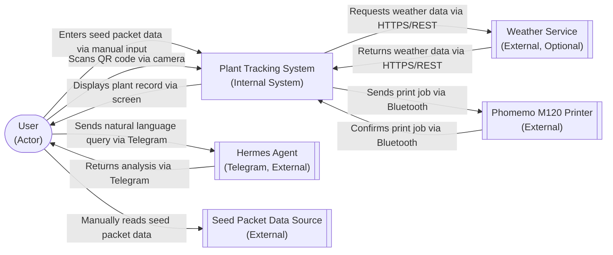

# ADR-0001: C1 System Context for Plant Tracking System

## Status
### Relationships
None

## Context
We are defining the system boundary for the Plant Tracking System to establish what is in scope versus out of scope for the MVP. The system is designed for home gardeners who want to track individual plants using QR-coded labels and derive insights through the Hermes agent. This context diagram will show the core entities that interact with the system and help stakeholders understand the system's purpose and boundaries. The decision affects all subsequent architectural work as it establishes the foundational scope. We need to clearly distinguish between internal system components and external systems/services that the system integrates with but does not control.

## Decision
We decided to define the Plant Tracking System boundary to include the core tracking system while keeping external integrations like Hermes Agent (via Telegram), Phomemo M120 Printer, Seed Packet Data Source, and Weather Service as external systems. This approach separates concerns between what we build and maintain versus what we integrate with.

### Alternatives Considered
- Alternative 1: Include Hermes Agent as an internal component since it provides core AI functionality
- Alternative 2: Include the Phomemo Printer as an internal component since label printing is essential to the user experience
- Alternative 3: Treat the Weather Service as internal since environmental data is important for plant tracking

### Trade-offs
#### Alternative 1 (Internal Hermes Agent)
- Pros: Tighter integration, potentially better performance, more control over AI features
- Cons: Increases system complexity, creates dependency on specific AI implementation, goes against PRD which specifies Hermes as accessed via Telegram

#### Alternative 2 (Internal Printer Component)
- Pros: Direct control over print quality and timing, eliminates Bluetooth communication complexity
- Cons: Makes system hardware-specific, prevents use with other printers, increases maintenance burden for printer drivers

#### Alternative 3 (Internal Weather Service)
- Pros: Guaranteed weather data availability, simpler integration for environmental tracking
- Cons: Adds significant complexity for data we don't control, introduces external API dependencies, contradicts PRD which shows weather as optional external service

## Consequences
This decision establishes a clear boundary between our system (plant tracking core) and external services we integrate with. It allows us to focus on building the core tracking functionality while leveraging existing services for AI, printing, and weather data. The system will need to handle integration complexities like authentication (Telegram), connectivity (Bluetooth printer), and data format translation. Future work may need to revisit these boundaries if we decide to bring certain integrations in-house for performance or reliability reasons.

## Diagram

## Related NFRs
- NFR-USAB-01: The interface should be usable in outdoor garden conditions with varying light levels
- NFR-PERF-02: Hermes agent queries should return insights within 10 seconds for natural conversation flow
- NFR-RELI-01: The system should maintain data integrity with zero lost or corrupted plant records under normal usage conditions