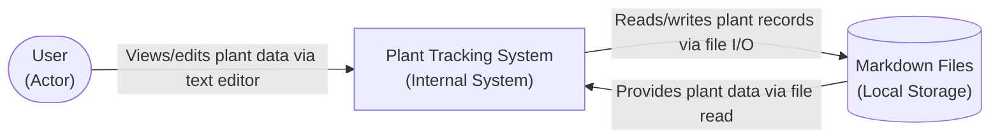

# ADR-0002: Data Storage Approach for Plant Tracking System

## Status
### Relationships
None

## Context
We need to decide on the data storage approach for the Plant Tracking System MVP. The system must store plant records, care activities, observations, and other tracking data. The PRD specifies starting with markdown files for storage with a planned migration path to Postgres. This decision affects data integrity, accessibility, development complexity, and future scalability. We need to choose an approach that balances simplicity for MVP with a clear path to more robust storage as the system grows.

## Decision
We decided to use local markdown files for data storage in the MVP, with a planned migration path to PostgreSQL for Phase 2. This approach provides immediate usability with zero setup complexity while maintaining a clear evolution path to a more scalable solution.

### Alternatives Considered
- Alternative 1: Start with PostgreSQL for both MVP and future phases
- Alternative 2: Use JSON files for storage instead of markdown
- Alternative 3: Use SQLite embedded database for MVP with PostgreSQL migration path

### Trade-offs
#### Alternative 1 (Start with PostgreSQL)
- Pros: Production-ready from day one, familiar querying capabilities, no migration needed later
- Cons: Significant setup complexity for MVP, over-engineering for simple tracking needs, creates barrier to entry for users

#### Alternative 2 (JSON Files)
- Pros: Structured data format, easy to parse programmatically, widely supported
- Cons: Less human-readable than markdown, harder to manually edit, no inherent formatting benefits

#### Alternative 3 (SQLite Embedded)
- Pros: Zero-configuration SQL database, familiar querying, good performance
- Cons: Still requires database conceptual understanding, file locking concerns, less transparent than markdown

## Consequences
This decision provides immediate value with minimal setup - users can start tracking plants by simply editing a markdown file. The human-readable format allows easy manual correction and backup. The clear migration path to PostgreSQL ensures we can scale when needed without data loss. However, we lose some benefits of a proper database like ACID transactions and complex querying capabilities in the MVP. Future work will need to implement the migration script and handle data transformation from markdown to PostgreSQL format.

## Diagram

## Related NFRs
- NFR-RELI-01: The system should maintain data integrity with zero lost or corrupted plant records under normal usage conditions
- NFR-DATA-02: Users should be able to export their complete plant database in standard formats (CSV, JSON)
- NFR-MAINT-01: Data format should be human-readable and editable for manual correction when needed
- NFR-DATA-03: Data should be migratable from markdown storage to Postgres format without loss of information