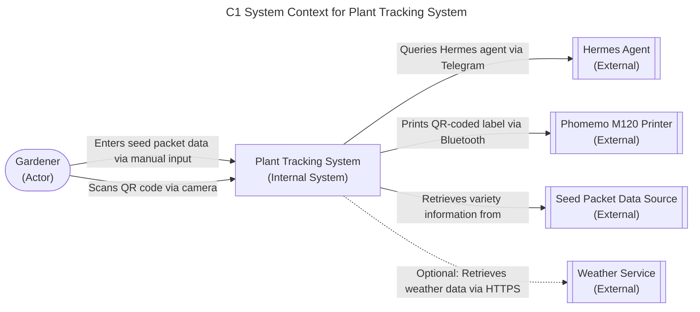

# ADR-0002 - System Context Diagram

## Status
Accepted - We need to define the system boundary and key external interactions for the Plant Tracking System. This C1 diagram shows the system in relation to its users and external dependencies. The system boundary clearly delineates what is internal to the Plant Tracking System versus what represents external entities that the system interacts with. Understanding these boundaries is crucial for determining system responsibilities, data flows, and integration points. This foundational diagram establishes the context for all subsequent architectural decisions and provides stakeholders with a clear view of the system's ecosystem.

### Relationships
None

## Context
We need to define the system boundary and key external interactions for the Plant Tracking System. This C1 diagram shows the system in relation to its users and external dependencies. Understanding these boundaries helps determine what functionality belongs inside the system versus what should be handled by external services. This is essential for architecture planning, integration design, and defining system responsibilities. Clear boundaries prevent scope creep and help teams understand where the system ends and external dependencies begin.

## Decision
We chose to model the Plant Tracking System as a single system with the following external entities:
- **Gardener (Actor)**: The home gardener who uses the system
- **Hermes Agent (External)**: AI agent accessed via Telegram for natural language querying and analysis
- **Phomemo M120 Printer (External)**: Bluetooth label printer for generating QR-coded labels
- **Seed Packet Data Source (External)**: Physical seed packets providing variety information
- **Weather Service (External)**: Optional service for environmental data (out of MVP scope)

### Alternatives Considered
- **Expanded System Boundary**: Including Hermes Agent and Phomemo Printer as internal components - Rejected because these are external services we don't own or control
- **Separate Systems for Each Function**: Modeling data storage, QR generation, and printing as separate systems - Rejected because they are tightly integrated components of our solution
- **Weather Service as Core Dependency**: Making weather data a required system input - Rejected because the PRD indicates this is optional and out of MVP scope

### Trade-offs
- **Single System Boundary Selected**:
  - *Pros*: Clear separation of concerns, simple to understand, accurate representation of ownership
  - *Cons*: Hides internal complexity, requires additional diagrams to show internal structure
- **Expanded Boundary Alternative**:
  - *Pros*: Shows more detail about integrated components
  - *Cons*: Misrepresents ownership, creates confusion about what we actually build vs integrate
- **Multiple Systems Alternative**:
  - *Pros*: Shows modularity and separation of concerns
  - *Cons*: Over-complicates the context view, misrepresents the cohesive nature of our solution
- **Required Weather Service Alternative**:
  - *Pros*: Ensures weather data availability for all use cases
  - *Cons*: Creates unnecessary dependency, increases scope beyond MVP, contradicts PRD

## Consequences
### Positive
- Clear boundary definition shows what's internal vs external
- Identifies all key user interactions and external dependencies
- Supports understanding of data flows and system responsibilities
- Provides foundation for more detailed C2 and C3 diagrams

### Negative
- Simplifies internal complexity into a single system node
- Doesn't show internal architectural decisions
- External systems are treated as black boxes

### Related NFRs
- NFR-USAB-01: Interface usable in outdoor garden conditions - Ensures the system works in various lighting conditions (bright sun to shade) for gardener usability. This NFR is critical for ensuring gardeners can use the system effectively regardless of lighting conditions they encounter in their garden, from bright midday sun to shaded areas under trees or structures. Gardeners often work in variable lighting conditions throughout the day, and the system must remain accessible and readable whether in full sunlight, partial shade, or overcast conditions to support effective plant tracking and data collection. Without this usability guarantee, gardeners would struggle to interact with the system during actual gardening activities, defeating the purpose of having a plant tracking system that works in real-world garden environments.
- NFR-RELI-01: QR code scanning works 95%+ of attempts - Specifies reliability requirement for QR code scanning under typical garden lighting conditions. This ensures the system remains functional and reliable when gardeners attempt to scan plant labels in various outdoor conditions. Reliable scanning is essential for the core workflow of accessing plant records via QR codes, and the system must maintain high success rates even when dealing with glare, shadows, or varying label orientations commonly encountered in garden environments. This reliability threshold ensures that the QR-based tracking system remains dependable enough for regular use in gardening routines.
- NFR-MAINT-01: Graceful degradation when optional features unavailable - Requires system to function when Hermes agent or weather service are unavailable. This ensures core functionality remains available even when optional integrations are not accessible. The system should provide meaningful fallback experiences when AI insights or weather data are temporarily unavailable, allowing gardeners to continue basic tracking and data entry operations without interruption. This graceful degradation mechanism ensures that the core value proposition of plant tracking remains intact even when optional AI-powered features or external data sources experience downtime or connectivity issues.

