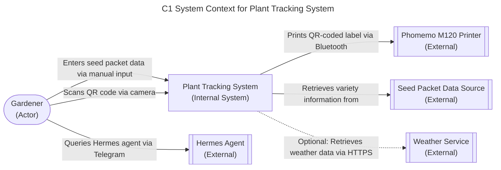

# ADR-0002 - System Context Diagram

## Status

Accepted

## Context

We need to define the system boundary and key external interactions for the Plant Tracking System. This C1 diagram shows the system in relation to its users and external dependencies.

## Decision

We chose to model the Plant Tracking System as a single system with the following external entities:

- **Gardener (Actor)**: The home gardener who uses the system
- **Hermes Agent (External)**: AI agent accessed via Telegram for natural language querying and analysis
- **Phomemo M120 Printer (External)**: Bluetooth label printer for generating QR-coded labels
- **Seed Packet Data Source (External)**: Physical seed packets providing variety information
- **Weather Service (External)**: Optional service for environmental data (out of MVP scope)

## Consequences

### Positive

- Clear boundary definition shows what's internal vs external
- Identifies all key user interactions and external dependencies
- Supports understanding of data flows and system responsibilities
- Provides foundation for more detailed C2 and C3 diagrams

### Negative

- Simplifies internal complexity into a single system node
- Doesn't show internal architectural decisions
- External systems are treated as black boxes

## Related NFRs

- NFR-USAB-01: Interface usable in outdoor garden conditions
- NFR-RELI-01: QR code scanning works 95%+ of attempts
- NFR-MAINT-01: Graceful degradation when optional features unavailable

## Relationships

None

## Diagram

