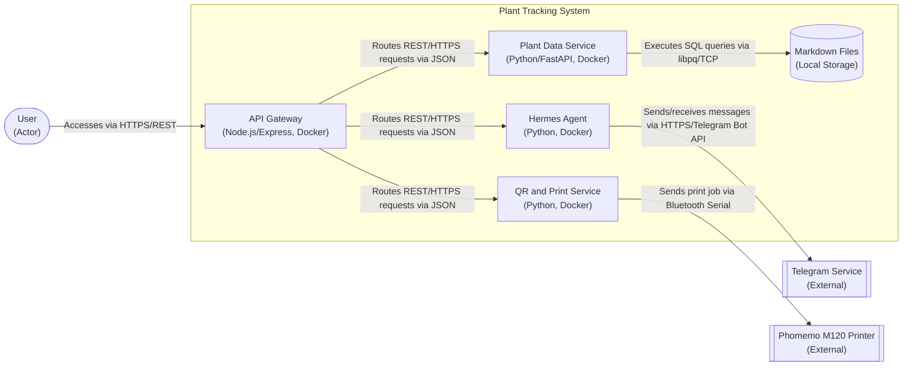

# ADR-0003: Container Architecture and Microservices for Plant Tracking System

## Status
Deprecated — Superseded by ADR-0008 (Architecture Refinement: Ports & Adapters)

### Relationships
Superseded by: ADR-0008 (Architecture Refinement: Ports & Adapters for Single-Service Backend)
Supersedes: None
Relates to: ADR-0005 (Backend Technology Stack)

## Context
As the Plant Tracking System grows in functionality, we need to decide on an architectural style that allows for independent development, deployment, and scaling of different system components. The system includes concerns like API gateway, data storage, QR generation/printing, AI agent integration, and potentially frontend services. We need to choose an architectural pattern that supports our goals of maintainability, scalability, and clear separation of concerns while keeping the MVP simple enough to implement.

## Decision
We decided to use a containerized microservices architecture with Docker for all backend services. Each major concern (API Gateway, Plant Data Service, QR and Print Service, Hermes Agent) runs in its own container, communicating via well-defined REST APIs over HTTPS.

### Alternatives Considered
- Alternative 1: Monolithic architecture with all components in a single container
- Alternative 2: Serverless functions (AWS Lambda) for each service
- Alternative 3: Hybrid approach with some components combined and others separated

### Trade-offs
#### Alternative 1 (Monolithic)
- Pros: Simpler deployment (single container), easier initial development, no network latency between components
- Cons: Scaling requires scaling the entire application, tighter coupling makes changes riskier, technology lock-in for the whole system

#### Alternative 2 (Serverless Functions)
- Pros: Automatic scaling, pay-per-use pricing, reduced operational overhead
- Cons: Cold start latency affecting response times, vendor lock-in, debugging complexity, limited execution duration, challenging for long-running processes like printer operations

#### Alternative 3 (Hybrid)
- Pros: Balance of simplicity and separation, can group related functions
- Cons: Still some coupling concerns, unclear boundaries between what should be combined vs separated

## Consequences
This decision enabled independent deployment and scaling of services, allowing us to update the QR printing service without affecting the data storage service, for example. It provided technology flexibility - each service could use the language/framework best suited to its purpose. However, it introduced operational complexity in managing multiple containers, network communication challenges, and the need for service discovery and load balancing (handled simply via direct REST calls in our MVP). We accepted this complexity because it aligned with our long-term scalability goals and kept services loosely coupled.

**Note: This ADR has been superseded by ADR-0008.** The microservices approach was refined to a single-service Ports & Adapters architecture after implementation revealed that our system has one bounded context and is maintained by a single developer, making the distributed complexity unjustified. See ADR-0008 for the current architectural decision.

## Diagram

## Related NFRs
- NFR-RELI-01: The system should maintain data integrity with zero lost or corrupted plant records under normal usage conditions
- NFR-MAINT-01: System should allow for graceful degradation when optional features (like Hermes agent) are unavailable
- NFR-DATA-03: Data should be migratable from markdown storage to Postgres format without loss of information