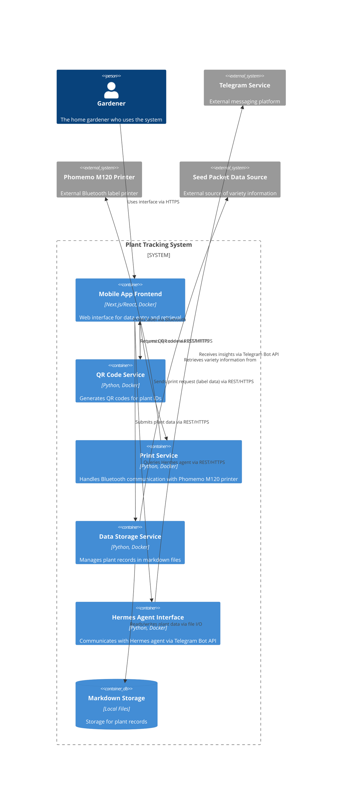

# Container Diagram for Plant Tracking System

## Status

Accepted - We need to define the deployable building blocks of the Plant Tracking System and how they communicate. This C2 diagram shows the containers within the system boundary. The container diagram is essential for understanding the deployment topology, technology choices, and communication patterns between services. It provides developers with a clear view of the system's modular structure and helps in planning development, testing, and deployment activities. By defining explicit containers with well-defined responsibilities, we enable independent development and scaling of system components.

### Relationships

None

## Context

We need to define the deployable building blocks of the Plant Tracking System and how they communicate. This C2 diagram shows the containers within the system boundary. Understanding the container structure is critical for architecture planning, as it defines the independently deployable units, their responsibilities, and the communication mechanisms between them. This diagram serves as a blueprint for development and DevOps teams, enabling them to understand how the system is structured and how changes in one container might affect others.

## Decision

We chose to model the following containers:
- **Gardener (Actor)**: The home gardener using the system
- **Mobile App Frontend**: Next.js/React interface for data entry and retrieval
- **QR Code Service**: Generates QR codes for plant IDs
- **Print Service**: Handles Bluetooth communication with Phomemo M120 printer
- **Data Storage Service**: Manages plant records in markdown files
- **Hermes Agent Interface**: Communicates with Hermes agent via Telegram Bot API
- **External Systems**: Telegram Service, Phomemo M120 Printer, Seed Packet Data Source

### Alternatives considered

- **Monolithic Container**: All functionality in a single container - Rejected because it would hinder independent scaling and deployment
- **Functional Containers per FR**: One container per functional requirement - Rejected because it would create excessive granularity and communication overhead
- **Layered Architecture**: Separate containers for presentation, business logic, and data - Rejected because it doesn't align with the microservices approach suggested by the PRD's focus on independent services

### Trade-offs

- **Selected Approach (Specialized Containers)**:
  - *Pros*: Clear separation of concerns, independent deployability, technology diversity per concern
  - *Cons*: Increased operational complexity, network latency between containers, need for service discovery
- **Monolithic Alternative**:
  - *Pros*: Simpler deployment, no network overhead between components
  - *Cons*: Scaling bottlenecks, technology lock-in, longer build/deploy times
- **Fine-Grained Alternative**:
  - *Pros*: Maximum independence, precise scaling
  - *Cons*: High operational overhead, complex communication patterns, increased failure points
- **Layered Alternative**:
  - *Pros*: Separation of concerns by concern type, familiar architecture pattern
  - *Cons*: Doesn't match the PRD's emphasis on independent services (QR, printing, data storage), may create bottlenecks

## Consequences

### Positive

- Clear separation of concerns with specialized containers
- Each container can be developed, deployed, and scaled independently
- Technology choices are explicit in container labels
- Communication pathways are well-defined
- Supports microservices architecture with Docker containerization

### Negative

- Increased operational complexity compared to monolith
- Network overhead between containers
- Requires service discovery and load balancing considerations
- Data consistency challenges across services

### Related nfrs

- NFR-PERF-02: Hermes agent queries return insights within 10 seconds - Ensures timely responses from the AI agent for effective user interaction
- NFR-RELI-01: Data integrity with zero lost records - Requires that plant data is never lost or corrupted during storage operations
- NFR-DATA-02: Export/import functionality in standard formats - Specifies that data must be exportable/importable in formats like CSV or JSON
- NFR-MAINT-01: Graceful degradation when optional features unavailable - Requires system to function when Hermes agent or other optional services are unavailable

