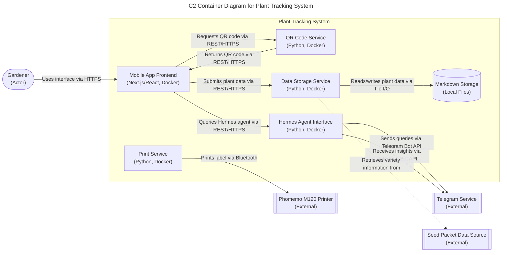

# Container Diagram for Plant Tracking System

## Status
Accepted

## Context
We need to define the deployable building blocks of the Plant Tracking System and how they communicate. This C2 diagram shows the containers within the system boundary.

## Decision
We chose to model the following containers:
- **Gardener (Actor)**: The home gardener using the system
- **Mobile App Frontend**: Next.js/React interface for data entry and retrieval
- **QR Code Service**: Generates QR codes for plant IDs
- **Print Service**: Handles Bluetooth communication with Phomemo M120 printer
- **Data Storage Service**: Manages plant records in markdown files
- **Hermes Agent Interface**: Communicates with Hermes agent via Telegram Bot API
- **External Systems**: Telegram Service, Phomemo M120 Printer, Seed Packet Data Source

## Consequences
### Positive
- Clear separation of concerns with specialized containers
- Each container can be developed, deployed, and scaled independently
- Technology choices are explicit in container labels
- Communication pathways are well-defined
- Supports microservices architecture with Docker containerization

### Negative
- Increased operational complexity compared to monolith
- Network overhead between containers
- Requires service discovery and load balancing considerations
- Data consistency challenges across services

## Related NFRs
- NFR-PERF-02: Hermes agent queries return insights within 10 seconds
- NFR-RELI-01: Data integrity with zero lost records
- NFR-DATA-02: Export/import functionality in standard formats
- NFR-MAINT-01: Graceful degradation when optional features unavailable

## Relationships
None

## Diagram
