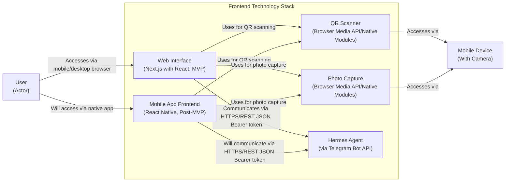

# ADR-0004: Frontend Technology Stack for Plant Tracking System

## Status
### Relationships
Superseded by: None
Supersedes: None
Relates to: None

## Context
We need to decide on the frontend technology stack for the Plant Tracking System. The system requires a user interface for viewing plant data, scanning QR codes, capturing photos, and entering observations. The PRD mentions a preference for cross-platform accessibility, starting with Android, and notes the user plans to use Hermes agent and Telegram integration. We need to choose technologies that support our goals of accessibility, performance in outdoor conditions, and integration capabilities.

## Decision
We decided to use Next.js with React for the web interface (MVP) and noted React Native as a [Post-MVP] option for mobile app development. This approach provides server-side rendering for better performance and SEO, leverages the React ecosystem, and offers a clear path to mobile development if needed.

### Alternatives Considered
- Alternative 1: Pure React Native for both MVP and mobile app
- Alternative 2: Flutter for cross-platform development
- Alternative 3: Ionic/Angular hybrid approach

### Trade-offs
#### Alternative 1 (React Native Only)
- Pros: Native performance, access to device capabilities, shared codebase for mobile
- Cons: Steeper learning curve, no web version available initially, overkill for simple MVP

#### Alternative 2 (Flutter)
- Pros: Excellent performance, beautiful UI capabilities, growing ecosystem
- Cons: Newer technology, smaller community, Dart language learning curve, less maturity for complex integrations

#### Alternative 3 (Ionic/Angular)
- Pros: Web technologies familiar to many developers, good documentation
- Cons: Performance limitations compared to native, larger app size, Angular complexity overhead

## Consequences
This decision provides immediate value with a performant web app that works on mobile browsers, leveraging familiar React patterns. The Next.js framework offers excellent developer experience with built-in optimizations. The clear [Post-MVP] tagging for React Native sets expectations for future mobile development. However, we defer native device capabilities until Post-MVP phases, meaning MVP users will rely on browser-based QR scanning and photo capture which may have slightly reduced performance compared to native implementations.

## Diagram

## Related NFRs
- NFR-USAB-01: The interface should be usable in outdoor garden conditions with varying light levels
- NFR-PERF-01: QR code scanning and plant data retrieval should complete within 3 seconds for optimal user experience in garden settings
- NFR-PERF-02: Hermes agent queries should return insights within 10 seconds for natural conversation flow