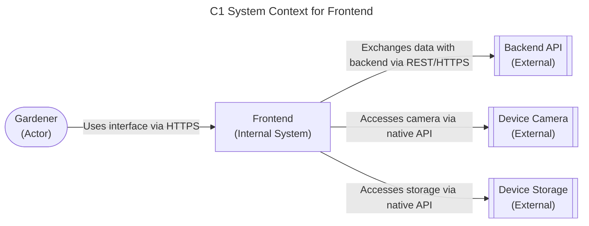

# Frontend Technology Stack for Plant Tracking System

## status
Accepted - The frontend technology stack has been selected for the Plant Tracking System. This decision outlines the technologies used for the user interface, enabling gardeners to interact with the system through QR scanning, photo capture, and data entry. The selection balances development efficiency, performance, and maintainability while supporting the project's greenfield nature and single developer constraints.

### relationships
None

## context
We need to select the frontend technology stack for the Plant Tracking System that supports QR code scanning and generation, photo capture for plant documentation, responsive design for mobile and web use, integration with backend services via REST/HTTPS, offline capabilities for garden environments (Post-MVP), and access to device capabilities (camera and storage). The frontend must be maintainable by a single developer and leverage familiar technologies. This selection impacts the user experience, development approach, and long-term maintenance of the system's client-side components.

## decision
We chose to use:
- **MVP (Web Interface)**: Next.js with React and TypeScript
  - Server-side rendering for better performance and SEO
  - TypeScript for type safety and developer productivity
  - Responsive design with Tailwind CSS
  - Deployed as a Docker container
- **Post-MVP (Mobile App)**: React Native with TypeScript
  - Cross-platform iOS and Android support
  - Access to native device capabilities (camera, Bluetooth)
  - Same business logic sharing potential with web interface
- **Shared Components**: 
  - QR code scanning library (react-qr-reader for web, react-native-camera for mobile)
  - State management with React Context or Zustand
  - Form handling with React Hook Form
  - Date handling with date-fns

## consequences
### positive
- Leverages developer familiarity with React ecosystem
- Enables code sharing between web and mobile (Post-MVP)
- Next.js provides excellent developer experience and performance
- TypeScript reduces runtime errors and improves maintainability
- Docker containerization ensures consistent deployment across environments

### negative
- Initial learning curve for Next.js if coming from plain React
- Docker adds complexity for simple web deployment
- Maintaining two codebases (web and mobile) increases development effort
- React Native requires native toolchain setup (Xcode, Android Studio) which may increase setup time

### related nfrs
- NFR-USAB-01: Interface usable in outdoor garden conditions
- NFR-PERF-02: Hermes agent queries return insights within 10 seconds
- NFR-RELI-01: System maintains data integrity with zero lost or corrupted records
- NFR-MAINT-01: Graceful degradation when optional features like Hermes agent are unavailable

### diagram
