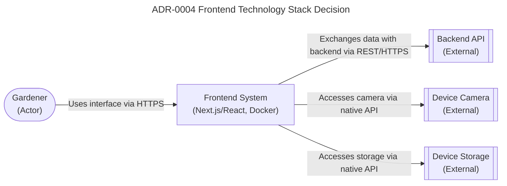

# Frontend Technology Stack for Plant Tracking System

## Status

Accepted - The frontend technology stack has been selected for the Plant Tracking System. This decision outlines the technologies used for the user interface, enabling gardeners to interact with the system through QR scanning, photo capture, and data entry. The selection balances development efficiency, performance, and maintainability while supporting the project's greenfield nature and single developer constraints.

### Relationships

None

## Context

We need to select the frontend technology stack for the Plant Tracking System that supports QR code scanning and generation, photo capture for plant documentation, responsive design for mobile and web use, integration with backend services via REST/HTTPS, offline capabilities for garden environments (Post-MVP), and access to device capabilities (camera and storage). The frontend must be maintainable by a single developer and leverage familiar technologies. This selection impacts the user experience, development approach, and long-term maintenance of the system's client-side components.

## Decision

We chose to use:
- **MVP (Web Interface)**: Next.js with React and TypeScript
  - Server-side rendering for better performance and SEO
  - TypeScript for type safety and developer productivity
  - Responsive design with Tailwind CSS
  - Deployed as a Docker container
- **Post-MVP (Mobile App)**: React Native with TypeScript
  - Cross-platform iOS and Android support
  - Access to native device capabilities (camera, Bluetooth)
  - Same business logic sharing potential with web interface
- **Shared Components**: 
  - QR code scanning library (react-qr-reader for web, react-native-camera for mobile)
  - State management with React Context or Zustand
  - Form handling with React Hook Form
  - Date handling with date-fns

### Alternatives Considered

- **Monolithic Frontend**: Single technology stack for web and mobile - Rejected because it would limit access to native device capabilities on mobile and provide suboptimal web performance
- **Separate Stacks**: Completely different technologies for web (Vue/Angular) and mobile (Swift/Kotlin) - Rejected because it would increase development effort and prevent code sharing
- **Cross-Platform Hybrid**: Ionic/Flutter for both web and mobile - Rejected because it would not provide optimal performance or access to all native capabilities

### Trade-offs

- **Selected Approach (Next.js/React Native)**:
  - *Pros*: Leverages React ecosystem familiarity, enables code sharing, provides excellent web performance, good mobile native access
  - *Cons*: Requires maintaining two codebases, initial learning curve for Next.js, Docker complexity for web deployment
- **Monolithic Frontend Alternative**:
  - *Pros*: Single technology context, simplified development
  - *Cons*: Limited mobile native capabilities, suboptimal performance on either platform
- **Separate Stacks Alternative**:
  - *Pros*: Optimal performance on each platform, full access to native capabilities
  - *Cons*: Significantly increased development effort, no code sharing, duplicated business logic
- **Cross-Platform Hybrid Alternative**:
  - *Pros*: Single codebase, consistent UI/UX
  - *Cons*: Performance limitations, restricted access to native capabilities, larger app size

## Consequences

### Positive

- Leverages developer familiarity with React ecosystem
- Enables code sharing between web and mobile (Post-MVP)
- Next.js provides excellent developer experience and performance
- TypeScript reduces runtime errors and improves maintainability
- Docker containerization ensures consistent deployment across environments

### Negative

- Initial learning curve for Next.js if coming from plain React
- Docker adds complexity for simple web deployment
- Maintaining two codebases (web and mobile) increases development effort
- React Native requires native toolchain setup (Xcode, Android Studio) which may increase setup time

### Related NFRs

- NFR-USAB-01: Interface usable in outdoor garden conditions - Ensures the frontend works in various lighting conditions (bright sun to shade) for gardener usability
- NFR-PERF-02: Hermes agent queries return insights within 10 seconds - Requires responsive frontend that doesn't add unnecessary latency to AI interactions
- NFR-RELI-01: System maintains data integrity with zero lost or corrupted records - Frontend must handle data validation and error states properly
- NFR-MAINT-01: Graceful degradation when optional features like Hermes agent are unavailable - Frontend should function when AI agent is unavailable with appropriate user feedback

### Diagram

