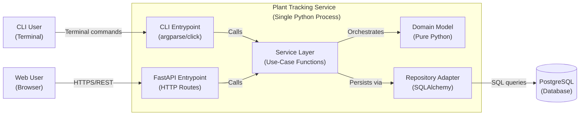

# ADR-0008 - Architecture Refinement: Ports & Adapters for Single-Service Backend

## Status

Accepted — We refined our architectural approach from distributed microservices to a modular monolith using Ports & Adapters (Hexagonal Architecture), with a shared service layer serving both CLI and FastAPI entrypoints.

### Relationships

Supersedes: ADR-0003 (Container Architecture and Microservices)
Relates to: ADR-0005 (Backend Technology Stack), ADR-0006 (Data Persistence Strategy)

## Context

Our original architecture (ADR-0003) prescribed a distributed microservices approach with separate API Gateway, Plant Data Service, QR and Print Service, and Hermes Agent containers communicating via inter-service REST calls. This decision was made before implementation began.

With implementation underway and the system requirements clearly defined as a single-developer project with one bounded context (plants, logs, seed packets, genera), we revisited the architectural choice against the principles in our software engineering wiki:

- **SWEBOK V4 KA02**: Microservices require multiple team boundaries and operational maturity to justify their complexity
- **Ports & Adapters (Tier 2)**: A single service with clear layer separation achieves the same goals of testability and infrastructure independence
- **Service Layer (Tier 2)**: Shared service functions callable from both CLI and HTTP entrypoints eliminate code duplication

The key requirements driving this refinement:
1. We need a REST API for the web frontend
2. We need CLI commands for garden-side operations
3. We have one bounded context with no natural service boundaries
4. We are a single developer, not multiple teams

## Decision

We adopted a **Ports & Adapters (Hexagonal Architecture)** pattern within a single Python service, structured as follows:

```
Entrypoints (CLI via argparse/click, FastAPI HTTP routes)
     ↓ calls
Service Layer (use-case functions: create_plant, log_watering, etc.)
     ↓ depends on
Domain Model (plain Python: validation, ID generation, business rules)
     ↑ implemented by
Adapters (SQLAlchemy ORM models, PostgreSQL session management)
     ↓ connects to
Infrastructure (PostgreSQL database)
```

### Layer Definitions

| Layer | Responsibility | Dependencies |
|---|---|---|
| **Entrypoints** | Parse CLI args / HTTP requests; call service functions; format responses | Imports service layer only |
| **Service Layer** | Use-case orchestration: fetch → domain operation → persist | Imports domain model and unit of work |
| **Domain Model** | Pure Python: validation, ID generation, business invariants | No infrastructure imports |
| **Adapters** | SQLAlchemy models, database sessions, Alembic migrations | Imports domain model |
| **Infrastructure** | PostgreSQL database, filesystem | External system |

### Key Principles

1. **Dependency arrows point inward** — Domain model never imports SQLAlchemy, FastAPI, or argparse
2. **Shared service layer** — CLI commands and FastAPI routes call the same service functions
3. **Repository pattern** — Domain defines `Protocol` interfaces; adapters provide SQLAlchemy implementations
4. **Unit of Work** — Database session managed by unit of work, not leaked into domain
5. **Testability** — Service layer tested with fake repositories, no database required

### Package Structure

```
packages/plant_service/
  src/plant_service/
    domain/              # Pure Python domain models (Plant, SeedPacket, Genus, PlantLogEntry)
    service_layer/       # Service protocols + UnitOfWork interface
    adapters/repository/ # SQLAlchemy implementations + SqlAlchemyUnitOfWork
    bootstrap.py         # Composition root (create_unit_of_work, etc.)
    config.py            # DATABASE_URL configuration

backend/fastapi/         # FastAPI entrypoint — separate package depending on plant_service
  src/plant_tracking_api/
    main.py              # FastAPI app + uvicorn runner
    config.py            # Settings (host, port, reload, log_level)
    dependencies.py      # FastAPI DI for UoW
    routes/              # HTTP route modules
tests/
  unit/                  # Domain + service layer tests (no DB)
  integration/           # Repository + UoW tests (real DB)
```

### Alternatives Considered

- **Microservices (ADR-0003)**: Separate services with inter-service REST calls — Rejected because single bounded context, single developer, no team boundary justification
- **Go microservice for core API**: New Go server implementing REST API — Rejected because it introduces distributed system complexity (network failures, service discovery, retries) with no domain boundary to justify it
- **Direct database access from entrypoints**: Current state — Rejected because it couples CLI and web UI to SQLAlchemy, preventing the domain from being tested independently

### Trade-offs

- **Selected Approach (Ports & Adapters, Single Service)**:
  - *Pros*: Single codebase, shared service layer, testable domain, clear separation of concerns, follows established patterns (Cosmic Python / DDD)
  - *Cons*: Less independence for deployment scaling; entire service must be restarted for changes
- **Microservices Alternative**:
  - *Pros*: Independent deployment and scaling per service
  - *Cons*: Distributed system failure modes, two codebases, operational complexity for single developer, no domain boundary justifies split
- **Go Microservice Alternative**:
  - *Pros*: Go's performance and concurrency model
  - *Cons*: Introduces second language, network latency, service discovery, retry logic; duplicates domain logic in another language

## Consequences

### Positive
- Single codebase with clear layer boundaries reduces maintenance burden
- Service functions callable from both CLI and FastAPI — zero business logic duplication
- Domain model testable without database — unit tests run in milliseconds
- Infrastructure can be swapped (PostgreSQL → SQLite for testing) without touching domain or service layer
- Aligns with software engineering best practices (SWEBOK KA02, Ports & Adapters, Service Layer patterns)

### Negative
- Existing SQLAlchemy models with business logic (`generate_id`, `create_from_dict`) need refactoring into pure domain functions
- Initial migration effort to separate concerns properly
- All entrypoints share the same process — a bug in CLI cannot crash the HTTP server (but neither can they scale independently)

### Neutral
- Alembic migrations remain unchanged
- PostgreSQL database schema remains unchanged
- Database connection string pattern (`DATABASE_URL`) remains unchanged

## Diagram



## Migration Plan

The current codebase has SQLAlchemy models with embedded business logic. The migration follows the **Strangler Fig** pattern (wiki/tier2-core/architecture-patterns/legacy-migration.md):

1. **Extract domain logic** — Move `generate_id`, `create_from_dict` validation into pure Python classes
2. **Create repository Protocols** — Define abstract interfaces in domain layer
3. **Create service functions** — Wrap existing operations in use-case functions
4. **Refactor CLI** — Point CLI commands to service functions
5. **Add FastAPI** — Create HTTP routes in `backend/fastapi/` that depend on `plant_service` package
6. **Retire legacy paths** — Remove direct SQLAlchemy usage from CLI once fully migrated

## Related NFRs

- NFR-RELI-01: Data integrity with zero lost or corrupted plant records
- NFR-MAINT-01: System maintainability through clear separation of concerns
- NFR-PERF-01: QR code scanning and plant data retrieval within 3 seconds
