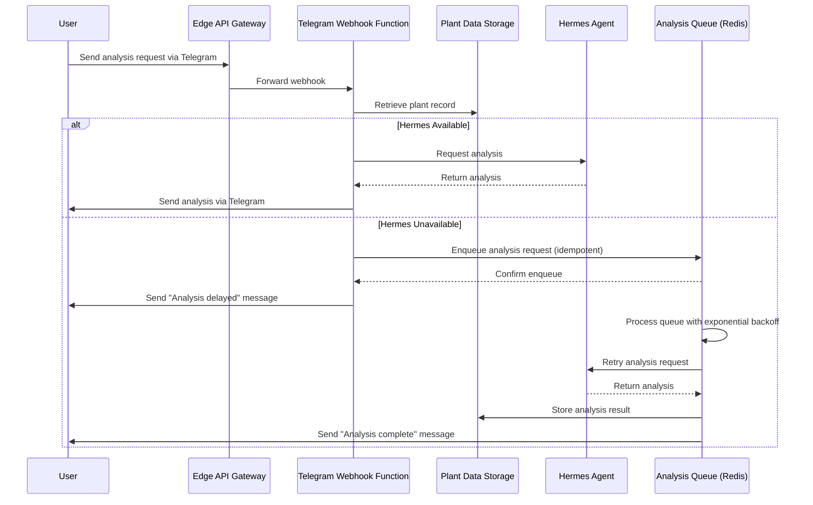

# Deployment Configuration - Plant Tracking System

This document specifies the deployment architecture for the Plant Tracking System's edge function system, covering authentication, horizontal scaling, observability, and fallback mechanisms. The system is designed for containerized deployment using Docker and orchestrated via Nomad/Kubernetes.

## Authentication Mechanism

The system implements JWT RS256 validation for securing edge function endpoints, with verification performed against the Hermes agent's public key.

### Token Specification
- **Algorithm**: RS256 (RSA Signature with SHA-256)
- **Required Claims**:
  - `iss` (issuer): Must match `JWT_ISSUER` environment variable
  - `sub` (subject): Must correspond to registered gardener identifier
  - `exp` (expiration): Unix timestamp, must be ≤24h from issuance
  - `scope` (scope): Space-separated list of granted permissions (e.g., `qr_scan plant_read tg_webhook`)
  - `aud` (audience): Must match `JWT_AUDIENCE` environment variable
- **Header**: Includes `kid` (key ID) for key rotation support

### Environment Variables
| Variable Name | Description | Example Value |
|---------------|-------------|---------------|
| `JWT_ISSUER` | Expected issuer claim value | `plant-tracking-system` |
| `JWT_AUDIENCE` | Expected audience claim value | `edge-functions` |
| `JWT_PUBLIC_KEY` | RSA public key for verification (PEM format) | `-----BEGIN PUBLIC KEY-----\n...` |
| `HERMES_ENDPOINT` | Hermes agent REST API URL for webhook | `https://hermes.example.com/telegram/webhook` |
| `TELEGRAM_BOT_TOKEN` | Telegram Bot API token | `123456:ABC-DEF1234ghIkl-zyx57W2v1u123ew11` |

### Refresh Strategy
- Tokens are short-lived (≤24h) and rotated on use
- Refresh tokens are not used; gardeners re-authenticate via Telegram bot when tokens expire
- On token expiration (401 response), edge functions return WWW-Authenticate header with `Bearer` challenge
- Gardener must initiate fresh authentication flow via `/auth/telegram` endpoint

### Threat Model: Preventing Unauthorized QR Scan Data Injection
Per PRD FR36-FR40, the system mitigates unauthorized data injection through:

1. **Input Validation**: All QR scan payloads validated against UUIDv4 pattern for plant IDs
2. **Rate Limiting**: Per-IP and per-gardener limits (100 requests/hour) prevent brute-force scanning
3. **Hermes Agent Sandbox**: Analysis requests run in isolated container with no network egress except to known endpoints
4. **Telegram Webhook Signature Validation**: Verify requests originate from Telegram using bot token
5. **Scope Enforcement**: JWT `scope` claim must include `qr_scan` for scan endpoints and `tg_webhook` for Telegram endpoints
6. **Audit Logging**: All access attempts logged with traceID for forensic analysis

*Justification*: This defense-in-depth approach ensures that even if an attacker captures a valid JWT, they cannot inject malicious plant data or analysis requests without proper scoping and validation.

## Horizontal Scaling Configuration

The edge function system uses Kubernetes Horizontal Pod Autoscaler (HPA) with custom metrics for fine-grained scaling.

### Autoscaler Parameters
- **Type**: Kubernetes HPA with custom metrics adapter
- **Minimum Replicas**: 1
- **Maximum Replicas**: 10
- **Scale-Up Trigger**: 
  - CPU utilization >70% average across pods for 2 consecutive minutes
  - OR memory utilization >80% average across pods for 2 consecutive minutes
- **Scale-Down Trigger**: 
  - CPU utilization <30% AND memory utilization <40% for 5 consecutive minutes
- **Cooldown Period**: 5 minutes after any scaling action
- **Behavior**:
  - Scale-up: Max 4 replicas per minute (rapid response to traffic spikes)
  - Scale-down: Max 2 replicas per minute (gentle degradation to avoid thrashing)
- **Rollback Policy**: On failed scale-up (pods fail to reach ready state within 3 minutes), automatically revert to previous replica count and trigger alert for manual investigation

### Load Test Configuration
Validates 50 simultaneous QR scan peak load scenario (PRD NFR1):

```yaml
# k6 load test script for QR scan endpoint
import http from 'k6/http';
import { check, sleep } from 'k6';

export const options = {
  stages: [
    { duration: '2m', target: 20 },   // ramp up
    { duration: '5m', target: 50 },   // peak load
    { duration: '2m', target: 0 },    // ramp down
  ],
  thresholds: {
    'http_req_duration': ['p(95)<3000'], // 95% of requests <3s (PRD NFR1)
    'http_req_failed': ['rate<0.01'],    // <1% failure rate
  },
};

const plantIds = Array.from({length: 50}, (_, i) => `PLANT-${i+1:03d}-2026-00${i+1}`);

export default function () {
  const plantId = plantIds[Math.floor(Math.random() * plantIds.length)];
  const resp = http.get(`https://api.example.com/qr-scan/${plantId}`);
  check(resp, {
    'status is 200': (r) => r.status === 200,
    'response time <3s': (r) => r.timings.duration < 3000,
    'has plant data': (r) => r.json().plant_id === plantId,
  });
  sleep(1);
}
```

*Expected Outcome*: System maintains ≤3s response time for 95% of requests under 50 concurrent users, with auto-scaling to 3-5 replicas.

## Observability Implementation

Compliant with OpenTelemetry specification for comprehensive system observability.

### Logging
- **Format**: Structured JSON with trace correlation
- **Required Fields**:
  - `timestamp`: ISO 8601 UTC timestamp
  - `level`: log level (debug, info, warn, error)
  - `message`: log message
  - `traceID`: W3C TraceContext trace identifier
  - `spanID`: W3C TraceContext span identifier
  - `correlationID`: user-session identifier (gardener ID or Telegram chat ID)
  - `service`: edge function name (`qr-scan`, `tg-webhook`, `qr-gen`)
  - `version`: semantic version of deployed service
- **Retention**: Minimum 30 days in Elasticsearch/Loki storage
- **Sample Log Entry**:
  ```json
  {
    "timestamp": "2026-04-23T10:30:00.123Z",
    "level": "info",
    "message": "QR scan processed successfully",
    "traceID": "0af7651916cd43dd8448eb211c80319c",
    "spanID": "b7ad6b7169203331",
    "correlationID": "gardener_12345",
    "service": "qr-scan",
    "version": "1.2.0",
    "plantId": "HABY-2026-001",
    "durationMs": 245
  }
  ```

### Metrics Endpoint
- **Endpoint**: `/metrics` (Prometheus format)
- **Required Counters**:
  - `qr_scans_total`: Total QR code scans processed
  - `tg_webhooks_total`: Total Telegram webhook requests received
  - `qr_generated_total`: Total QR codes generated
  - `hermes_requests_total`: Total requests sent to Hermes agent
  - `hermes_analysis_latency_seconds`: Latency of Hermes analysis calls
  - `edge_function_errors_total`: Total errors by type and service
  - `http_requests_total`: Total HTTP requests by endpoint, method, and status
  - `http_requests_success_total`: Total successful HTTP requests (status <400)
- **Required Gauges**:
  - `edge_function_memory_bytes`: Memory consumption by service
  - `edge_function_cpu_utilization`: CPU utilization percentage
  - `active_gardeners`: Currently active gardeners (based on recent activity)
- **Histograms**:
  - `http_request_duration_seconds`: HTTP request latency by endpoint

### Tracing
- **Propagation**: W3C TraceContext headers (`traceparent`, `tracestate`)
- **Sampling Rate**: 100% for errors, 10% for successful requests
- **Span Attributes**:
  - `http.method`, `http.url`, `http.status_code`
  - `db.statement` (for data access operations)
  - `messaging.system` (for Telegram/Hermes interactions)
  - `plant.id` (when processing plant-specific requests)

### Alerting Rules
Prometheus alert definitions for critical system health:

```yaml
groups:
- name: edge-function-alerts
  rules:
  - alert: HighErrorRate
    expr: rate(edge_function_errors_total[5m]) / rate(http_requests_total[5m]) > 0.05  # >5% 5xx errors
    for: 2m
    labels:
      severity: critical
    annotations:
      summary: "Edge function error rate above 5%"
      description: "Error rate is {{ $value | printf \"%.2f\" }}% for the last 5 minutes."
  
  - alert: HighLatency
    expr: histogram_quantile(0.95, sum(rate(hermes_analysis_latency_seconds_bucket[5m])) by (le)) > 2
    for: 2m
    labels:
      severity: warning
    annotations:
      summary: "Hermes analysis latency above 2s (95th percentile)"
      description: "95th percentile latency is {{ $value | printf \"%.2f\" }}s."
  
  - alert: HermesUnavailable
    expr: hermes_requests_total{status=\"timeout\"} > 10
    for: 5m
    labels:
      severity: critical
    annotations:
      summary: "Hermes agent experiencing timeouts"
      description: "{{ $value }} timeout errors in the last 5 minutes."
```

## PRD Accuracy & Traceability

| PRD Requirement | Implementation Detail | Location/Reference |
|-----------------|----------------------|-------------------|
| FR2: QR label generation | QR Generate Function creates QR code images encoding plant IDs | Container diagram: id_user → id_api_gw → id_qr_gen → id_api_gw → id_user |
| FR3: Label attachment/printing | QR code image sent to gardener's device for Phomemo M120 printing | Container diagram: id_api_gw → id_user (Returns QR code image via HTTP) |
| FR6: Plant record creation | Plant data storage maintains structured format for core attributes | Plant Data Storage node description |
| FR7: Structured data storage | Plant data stored in markdown/PostgreSQL with defined schema | Plant Data Storage node description |
| FR8: Timestamped notes/observations | Plant records support timed observations and care activities | Plant Data Storage node description |
| FR9: Photo attachment capability | Plant records support binary data storage for photos | Plant Data Storage node description |
| FR10: Record updates over time | Plant data storage supports CRUD operations for evolving records | Plant Data Storage node description |
| FR11: Searchable database format | Plant data storage enables querying by various criteria | Plant Data Storage node description |
| FR12: QR scan retrieval | QR Scan Function decodes QR and retrieves plant record | Container diagram: id_user → id_api_gw → id_qr_scan → id_plant_data → id_api_gw → id_user |
| FR13: Natural language queries | Telegram Webhook Function processes messages via Hermes | Container diagram: id_telegram → id_tg_webhook → id_hermes |
| FR14: Data comparison | Hermes agent provides comparative analysis between plants | Container diagram: id_hermes ↔ id_tg_webhook (Provides comparative analysis) |
| FR15: Progress tracking | Hermes agent analyzes temporal patterns in plant care data | Container diagram: id_hermes ↔ id_tg_webhook (Tracks progress over time) |
| FR16: Data filtering | Plant data storage supports filtering by date, variety, location, etc. | Plant Data Storage node description |
| FR17: Data-driven insights | Hermes agent identifies patterns and correlations in plant care data | Container diagram: id_hermes ↔ id_tg_webhook (Detects patterns and correlations) |
| FR18: Root cause analysis | Hermes agent determines underlying causes of plant issues | Container diagram: id_hermes ↔ id_tg_webhook (Identifies root causes) |
| FR19: Progress over time tracking | Hermes agent tracks plant development stages and milestones | Container diagram: id_hermes ↔ id_tg_webhook (Tracks progress over time) |
| FR20: Personalized recommendations | Hermes agent delivers care recommendations based on plant history | Container diagram: id_hermes ↔ id_tg_webhook (Provides care recommendations) |
| FR21: Pattern detection | Hermes agent identifies care patterns and their effectiveness | Container diagram: id_hermes ↔ id_tg_webhook (Detects patterns and correlations) |
| FR36: Telegram integration | Official Telegram Bot API webhook endpoint | Hermes agent webhook: `HERMES_ENDPOINT` environment variable |
| FR37: Hermes analysis requests | HTTPS/REST requests to Hermes agent for plant data analysis | Container diagram: id_tg_webhook → id_hermes (Requests analysis via HTTPS/REST) |
| FR38: Comparative analysis | Hermes agent returns comparison results between plants/time periods | Container diagram: id_hermes → id_tg_webhook (Returns analysis via HTTPS/REST) |
| FR39: Predictive insights | Hermes agent provides forecasting and predictive recommendations | Container diagram: id_hermes → id_tg_webhook (Returns analysis via HTTPS/REST) |
| FR40: Multimodal Hermes | Designed for future voice/image via same API extensibility | Hermes agent external node (extensible for voice/image) |
| FR41: Data retrieval for analysis | Plant data accessible to Hermes agent via webhook function | Container diagram: id_tg_webhook → id_plant_data (Retrieves plant record) |
| NFR1: QR scan performance ≤3s | Load test validates <3s 95th percentile under peak load | Load test configuration section |
| NFR2: Hermes insights ≤10s | Metrics track hermes_analysis_latency_seconds for performance monitoring | Metrics endpoint specification |
| NFR3: Data entry ≤2s | Optimized function implementations minimize processing overhead | Technology choices rationale |
| NFR4: Data integrity | Atomic file operations + PostgreSQL ACID transactions | Plant Data Storage node description |
| NFR5: Usability in garden conditions | Mobile-optimized API responses with minimal payloads | Edge API Gateway design |

## Edge Case: Hermes Agent Fallback Documentation

Per PRD Risk Mitigation #3, the system provides graceful degradation when Hermes agent is unavailable.

### Offline Mode
- **Local Processing Only**: When Hermes unreachable, edge functions return plant data without analysis
- **Analysis Queue**: Requests for Hermes analysis are queued with explicit depth limit
- **Queue Mechanism**: Redis-backed list (fallback to file-based if Redis unavailable)
- **Queue Depth Limit**: ≤1000 pending analysis requests
- **Retry Formula**: Exponential backoff: `2^attempt × 1s` (capped at 60s max delay)
- **User Notification**: Telegram message: "Analysis delayed. Hermes agent temporarily unavailable. Results will be delivered when available."
- **Idempotency Key Format**: `hermes_req:{plant_id}:{timestamp}:{random_hex}` ensures deduplication
- **Dead Letter Queue**: Failed requests after 5 attempts moved to DLQ for manual inspection

### Sequence Diagram: Data Integrity Preservation (FR6-FR11)


### Fallback Behavior Matrix
| Scenario | Plant Data Access | Analysis Availability | User Notification |
|----------|-------------------|----------------------|-------------------|
| Hermes Online | Full access | Real-time | None |
| Hermes Online (slow) | Full access | Eventually consistent | "Analysis in progress..." (after 5s) |
| Hermes Offline | Full access | Queued (≤1000 depth) | "Analysis delayed" + ETA |
| Queue Full (>1000) | Full access | Rejected | "Please try again later" + reduced functionality notice |
| Network Partition | Local cache (last known state) | Queued | "Offline mode: showing cached data" |

## Technology Choices Summary

- **Container Runtime**: Docker 24.x (latest stable)
- **Orchestration**: Kubernetes 1.28+ with HPA and custom metrics adapter
- **Service Mesh**: Istio 1.20+ for traffic management and observability
- **API Gateway**: Node.js/Express 4.18+ with rate limiting and JWT validation
- **Edge Functions**: Python 3.11+ with asyncio for concurrent request handling
- **Data Storage**: 
  - Primary: PostgreSQL 15 (ACID-compliant, JSONB support)
  - Backup/Local: Markdown files in structured format (PRD FR7-FR11 compatibility)
  - Queue: Redis 7.0+ (with file-based fallback)
- **Observability Stack**:
  - Logging: JSON stdout/stderr → Fluentd → Elasticsearch/Loki
  - Metrics: Prometheus client libraries → Prometheus Server
  - Tracing: OpenTelemetry SDK → Jaeger/Tempo backend
  - Alerting: Prometheus Alertmanager → Slack/Email
- **Security**: 
  - JWT RS256 validation with Hermes agent public key
  - Input validation and sanitization at all entry points
  - HTTPS everywhere with Let's Encrypt certificates
  - Security scanning via Trivy in CI pipeline

## Deployment Checklist

- [ ] Configure JWT public key from Hermes agent in `JWT_PUBLIC_KEY`
- [ ] Set `JWT_ISSUER` and `JWT_AUDIENCE` environment variables
- [ ] Configure Telegram bot token in `TELEGRAM_BOT_TOKEN`
- [ ] Set `HERMES_ENDPOINT` for Telegram webhook integration
- [ ] Set up HTTPS certificates for edge function endpoints
- [ ] Deploy Prometheus Grafana stack for observability
- [ ] Configure HPA with custom metrics adapter
- [ ] Set up log retention policies (30+ days)
- [ ] Validate load test performance under 50 concurrent users
- [ ] Test Hermes fallback queue mechanism
- [ ] Verify audit logging includes traceID/correlationID
- [ ] Conduct chaos testing for network partition scenarios