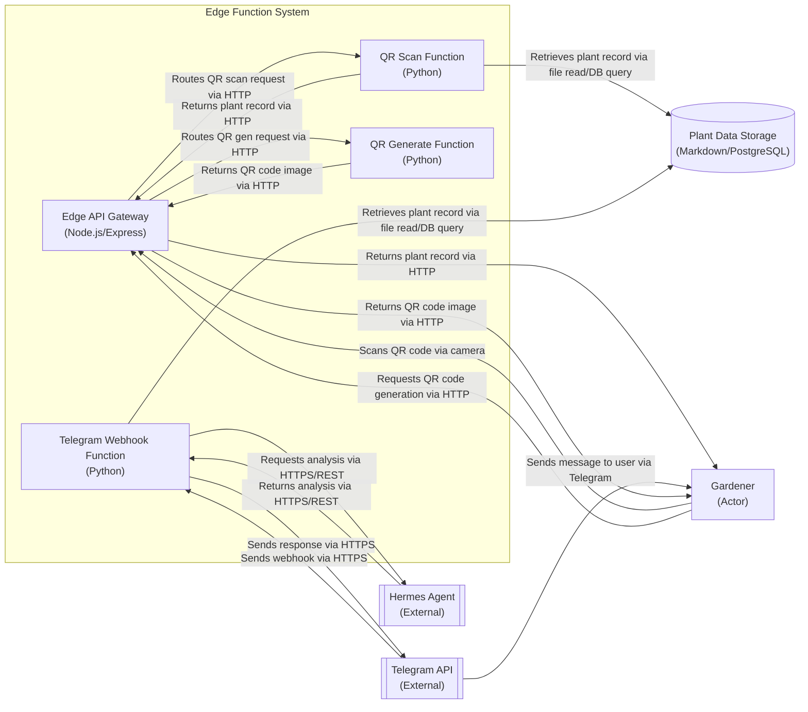

## Edge Function System Overview

The edge function system handles low-latency interactions for QR code scanning, Telegram webhook processing, and QR code generation. It consists of an API gateway that routes requests to specialized Python-based functions, which interact with plant data storage, the Hermes agent for AI analysis, and the Telegram API for messaging.

## Container Diagram

## Relationship Description

| Relationship | Label | Description | PRD Reference |
|--------------|-------|-------------|---------------|
| User → Edge API Gateway | Scans QR code via camera | Gardener scans QR code on plant label using mobile device camera, triggering HTTP request to edge API gateway | FR12 |
| Edge API Gateway → QR Scan Function | Routes QR scan request via HTTP | API gateway forwards QR scan event to dedicated function for plant record retrieval | FR12 |
| QR Scan Function → Plant Data Storage | Retrieves plant record via file read/DB query | Function queries plant data storage (markdown files or PostgreSQL) using decoded plant ID from QR code | FR7, FR11 |
| QR Scan Function → Edge API Gateway | Returns plant record via HTTP | Function returns complete plant record to API gateway for response to user | FR12 |
| Edge API Gateway → User | Returns plant record via HTTP | API gateway sends plant record back to gardener's mobile device | FR12 |
| Telegram API → Telegram Webhook Function | Sends webhook via HTTPS | Telegram sends incoming message from user to edge function webhook endpoint | FR36 |
| Telegram Webhook Function → Plant Data Storage | Retrieves plant record via file read/DB query | Function fetches plant record based on user query (e.g., plant ID mentioned in message) | FR7, FR11 |
| Telegram Webhook Function → Hermes Agent | Requests analysis via HTTPS/REST | Function sends plant data and user query to Hermes agent for AI-powered analysis | FR37, FR38 |
| Hermes Agent → Telegram Webhook Function | Returns analysis via HTTPS/REST | Hermes agent returns analysis results to edge function | FR37, FR38 |
| Telegram Webhook Function → Telegram API | Sends response via HTTPS | Function sends formatted analysis response back to Telegram API | FR36 |
| Telegram API → User | Sends message to user via Telegram | Telegram delivers analysis response to gardener via bot chat | FR36 |
| User → Edge API Gateway | Requests QR code generation via HTTP | Gardener requests QR code generation for new plant via frontend interface | FR2 |
| Edge API Gateway → QR Generate Function | Routes QR gen request via HTTP | API gateway forwards QR generation request to dedicated function | FR2 |
| QR Generate Function → Edge API Gateway | Returns QR code image via HTTP | Function generates QR code image encoding plant ID and returns to API gateway | FR2 |
| Edge API Gateway → User | Returns QR code image via HTTP | API gateway sends QR code image to gardener's device for printing via Phomemo M120 | FR3 |

## Edge Function Responsibilities

- **QR Scan Function**: Decodes QR scan events, retrieves plant records, returns data for display
- **Telegram Webhook Function**: Processes natural language queries, coordinates with Hermes agent for analysis, returns responses
- **QR Generate Function**: Creates QR code images encoding plant IDs for label printing
- **Edge API Gateway**: Provides unified entry point, request routing, rate limiting, and response formatting

## Technology Choices

- **Node.js/Express**: Selected for API gateway due to mature ecosystem, performance, and ease of middleware implementation
- **Python**: Used for all edge functions to leverage rich libraries for data processing, AI integration, and QR code generation
- **Markdown/PostgreSQL**: Plant data storage maintains backward compatibility with markdown while supporting PostgreSQL migration path
- **Hermes Agent**: External AI service accessed via REST for plant data analysis and natural language querying
- **Telegram API**: Official Telegram Bot API for reliable messaging infrastructure