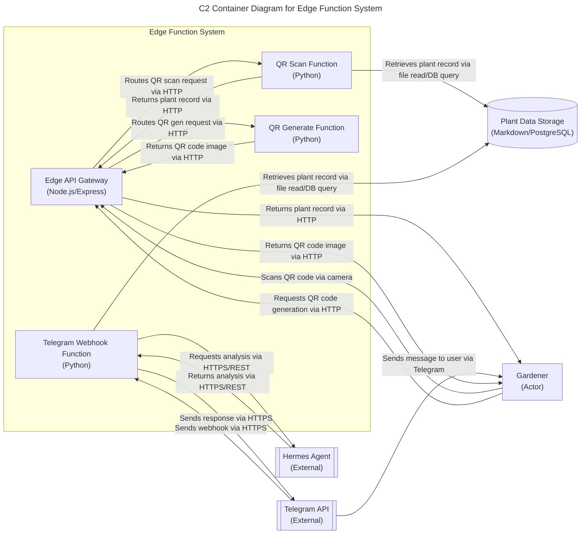

# Edge Function System - C2 Container Diagram

## Overview

The edge function system handles low-latency interactions for QR code scanning,
Telegram webhook processing, and QR code generation. It consists of an API gateway
that routes requests to specialized Python-based functions, which interact with
plant data storage, the Hermes agent for AI analysis, and the Telegram API for
messaging. The edge function serves as the data access layer for the plant
tracking system.

## Container Diagram

## Requirement Details

### FR2: QR label generation
Users can generate a unique plant ID using the VARIETY-YYYY-SEQ format and create
QR codes that encode only the plant ID for label printing.

### FR3: Label attachment/printing
Users can print QR-coded labels using the Phomemo M120 Bluetooth label printer and
attach labels to plants, pots, or stakes in garden environments.

### FR6: Plant record creation
Users can create plant records with core attributes from seed packet information.

### FR7: Structured data storage
Users can store plant data in markdown files with structured format.

### FR8: Timestamped notes/observations
Users can add notes and observations to plant records with timestamps.

### FR9: Photo attachment capability
Users can attach photos to plant records for visual documentation.

### FR10: Record updates over time
Users can update plant records with new information over time.

### FR11: Searchable database format
Users can store multiple plants in a searchable database format.

### FR12: QR scan retrieval
Users can scan QR codes to instantly retrieve plant records.

### FR13: Natural language queries
Users can query plant data using natural language via Hermes agent.

### FR14: Data comparison
Users can compare data between different plants.

### FR15: Progress tracking
Users can track plant progress over time (growth, flowering, fruiting).

### FR16: Data filtering
Users can filter plant records by various criteria (date, variety, location, etc.).

### FR17: Data-driven insights
Users can receive data-driven insights about plant health and care patterns.

### FR18: Root cause analysis
Users can identify root causes of plant issues through data analysis.

### FR19: Progress over time tracking
Users can track plant progress over time (growth, flowering, fruiting).

### FR20: Personalized recommendations
Users can receive personalized care recommendations based on plant history.

### FR21: Pattern detection
Users can detect patterns and correlations in plant care data.

### FR36: Telegram integration
Users can interact with Hermes agent via Telegram for natural language queries.

### FR37: Hermes analysis requests
Users can request analysis of specific plant data and conditions.

### FR38: Comparative analysis
Users can ask for comparisons between different plants or time periods.

### FR39: Predictive insights
Users can receive predictive insights and recommendations from Hermes.

### FR40: Multimodal Hermes
Users can use Hermes for multimodal interactions (text, image, voice when available).

### FR41: Data retrieval for analysis
Users can retrieve complete plant records by scanning QR codes for analysis.

## Relationship Description

| Relationship | Label | Description | PRD Reference |
|--------------|-------|-------------|---------------|
| Gardener → Edge API Gateway | Scans QR code via camera | Gardener scans QR code on plant label using mobile device camera, triggering HTTP request to edge API gateway | [FR12](#fr12-qr-scan-retrieval) |
| Edge API Gateway → QR Scan Function | Routes QR scan request via HTTP | API gateway forwards QR scan event to dedicated function for plant record retrieval | [FR12](#fr12-qr-scan-retrieval) |
| QR Scan Function → Plant Data Storage | Retrieves plant record via file read/DB query | Function queries plant data storage (markdown files or PostgreSQL) using decoded plant ID from QR code | [FR7](#fr7-structured-data-storage), [FR11](#fr11-searchable-database-format) |
| QR Scan Function → Edge API Gateway | Returns plant record via HTTP | Function returns complete plant record to API gateway for response to user | [FR12](#fr12-qr-scan-retrieval) |
| Edge API Gateway → Gardener | Returns plant record via HTTP | API gateway sends plant record back to gardener's mobile device | [FR12](#fr12-qr-scan-retrieval) |
| Telegram API → Telegram Webhook Function | Sends webhook via HTTPS | Telegram sends incoming message from user to edge function webhook endpoint | [FR36](#fr36-telegram-integration) |
| Telegram Webhook Function → Plant Data Storage | Retrieves plant record via file read/DB query | Function fetches plant record based on user query (e.g., plant ID mentioned in message) | [FR7](#fr7-structured-data-storage), [FR11](#fr11-searchable-database-format) |
| Telegram Webhook Function → Hermes Agent | Requests analysis via HTTPS/REST | Function sends plant data and user query to Hermes agent for AI-powered analysis | [FR37](#fr37-hermes-analysis-requests), [FR38](#fr38-comparative-analysis) |
| Hermes Agent → Telegram Webhook Function | Returns analysis via HTTPS/REST | Hermes agent returns analysis results to edge function | [FR37](#fr37-hermes-analysis-requests), [FR38](#fr38-comparative-analysis) |
| Telegram Webhook Function → Telegram API | Sends response via HTTPS | Function sends formatted analysis response back to Telegram API | [FR36](#fr36-telegram-integration) |
| Telegram API → Gardener | Sends message to user via Telegram | Telegram delivers analysis response to gardener via bot chat | [FR36](#fr36-telegram-integration) |
| Gardener → Edge API Gateway | Requests QR code generation via HTTP | Gardener requests QR code generation for new plant via frontend interface | [FR2](#fr2-qr-label-generation) |
| Edge API Gateway → QR Generate Function | Routes QR gen request via HTTP | API gateway forwards QR generation request to dedicated function | [FR2](#fr2-qr-label-generation) |
| QR Generate Function → Edge API Gateway | Returns QR code image via HTTP | Function generates QR code image encoding plant ID and returns to API gateway | [FR2](#fr2-qr-label-generation) |
| Edge API Gateway → Gardener | Returns QR code image via HTTP | API gateway sends QR code image to gardener's device for printing via Phomemo M120 | [FR3](#fr3-label-attachment-printing) |
| Hermes Agent → Telegram Webhook Function | Provides comparative analysis | Hermes agent compares data between different plants or time periods | [FR14](#fr14-data-comparison) |
| Hermes Agent → Telegram Webhook Function | Tracks progress over time | Hermes agent analyzes temporal patterns in plant care data | [FR15](#fr15-progress-tracking) |
| Hermes Agent → Telegram Webhook Function | Identifies root causes | Hermes agent determines underlying causes of plant issues through data analysis | [FR18](#fr18-root-cause-analysis) |
| Hermes Agent → Telegram Webhook Function | Provides care recommendations | Hermes agent delivers personalized care recommendations based on plant history | [FR20](#fr20-personalized-recommendations) |
| Hermes Agent → Telegram Webhook Function | Detects patterns and correlations | Hermes agent identifies correlations in plant care data | [FR21](#fr21-pattern-detection) |

## Edge Function Responsibilities

- **QR Scan Function**: Decodes QR scan events, retrieves plant records, returns data for display
- **Telegram Webhook Function**: Processes natural language queries, coordinates with Hermes agent for analysis, returns responses
- **QR Generate Function**: Creates QR code images encoding plant IDs for label printing
- **Edge API Gateway**: Provides unified entry point, request routing, rate limiting, and response formatting; serves as data access layer for plant tracking system

## Technology Choices

- **Node.js/Express**: Selected for API gateway due to mature ecosystem, performance, and ease of middleware implementation
- **Python**: Used for all edge functions to leverage rich libraries for data processing, AI integration, and QR code generation
- **Markdown/PostgreSQL**: Plant data storage maintains backward compatibility with markdown while supporting PostgreSQL migration path
- **Hermes Agent**: External AI service accessed via REST for plant data analysis and natural language querying
- **Telegram API**: Official Telegram Bot API for reliable messaging infrastructure