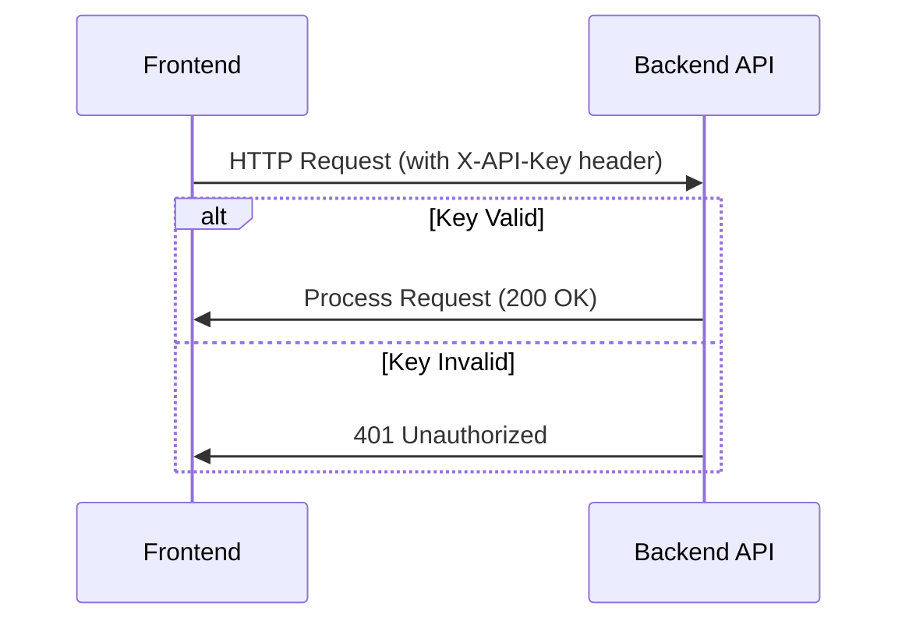

# Authentication Design

The Plant Tracking System employs a simple API key-based authentication mechanism for the MVP, leveraging the personal-use nature of the application. Since the system is intended for individual gardeners on trusted devices, we avoid complex authentication flows while maintaining basic security for API endpoints.

## Authentication Flow

The frontend communicates with the backend API via REST over HTTPS. Each request includes an API key in the request header for validation.

## Token Exchange

- **Header**: `X-API-Key: <api_key>`
- **Value**: Shared secret stored in environment variables (`PLANT_TRACKER_API_KEY`)
- **Exchange**: No dynamic token exchange; static key configured at deployment
- **Transmission**: HTTPS only (TLS 1.2+)

## Refresh Strategy

- No token refresh mechanism required for static API key
- Key rotation: Manual process via environment variable update and service restart
- Recommended rotation interval: 90 days for security hygiene

## Error Handling

- **401 Unauthorized**: Returned when:
  - Missing `X-API-Key` header
  - Invalid API key format
  - API key does not match stored secret
- Response body: `{"error": "Unauthorized", "message": "Invalid or missing API key"}`
- No retry-after header; client must resolve configuration issue

## Security Considerations

- **Strengths**:
  - Simple to implement and audit
  - No storage of sensitive user credentials
  - Zero dependencies on external auth providers
- **Limitations**:
  - Shared secret model (same key for all users)
  - No user-specific authorization
  - Key compromise affects all instances
- **Mitigations**:
  - HTTPS enforcement prevents key interception
  - Environment variable storage avoids hardcoded keys
  - Audit logging of failed authentication attempts

## Future Improvements

Post-MVP, we plan to replace API key authentication with Telegram-based authentication:

1. User initiates login via Telegram bot
2. Backend verifies Telegram identity using bot token
3. Issue JWT with Telegram ID as subject
4. Frontend stores JWT in secure HTTP-only cookie
5. Refresh tokens for extended sessions
6. Role-based access (gardener/admin) for future multi-user scenarios

## Interface Contract

**Endpoint**: All backend API routes  
**Method**: GET, POST, PUT, DELETE  
**Header**: `X-API-Key: <string>` (required)  
**Success**: 2xx status codes  
**Authentication Failure**: 401 Unauthorized  
**Rate Limiting**: 60 requests/minute per IP (MVP)  

## PRD Traceability

- FR13: Natural language queries via Hermes agent - Authentication not required for Telegram interface (user already authenticated in Telegram)
- FR41-FR45: Mobile interface access - API key enables secure backend communication for data persistence
- NFR5: Data integrity - Authentication prevents unauthorized data modification