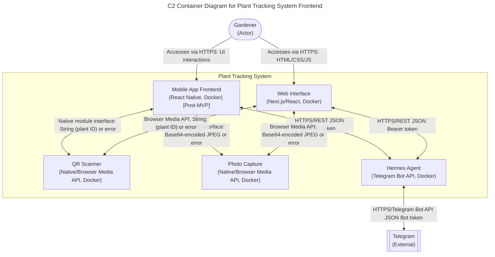

# Plant Tracking System Frontend - C2 Container Diagram

## Scope
This C2 container diagram focuses on the frontend components of the Plant Tracking System as specified in Sprint 3 (Frontend Container). It includes the five required containers: Mobile App Frontend, Web Interface, QR Scanner, Photo Capture, and Hermes Agent. External systems and actors are shown where they interact with these containers. All components are scoped to the MVP as defined in PRD sections 2.1-2.3, with Post-MVP features explicitly tagged where applicable.

## Assumptions & Constraints
- The system assumes connectivity will be available in 2026 (PRD: "Offline Mode: Not required as the user assumes connectivity will be available in 2026")
- Hermes agent integration is via Telegram Bot API (PRD: "Integration Approach: Direct integration with Hermes agent via Telegram for AI-powered analysis and natural language interface")
- QR code scanning and photo capture utilize device cameras through native APIs or browser Media API
- Data storage, backend services, and printer interfaces are out of scope for this frontend-focused diagram (per PRD scope accuracy requirement)
- All communication between frontend containers and Hermes Agent uses REST over HTTPS with JSON payloads and Bearer token authentication
- The Hermes Agent container represents the AI analysis capability; its actual implementation may rely on external services but is treated as a single container for frontend interaction purposes

## Container Definitions

### Mobile App Frontend [Post-MVP]
**Primary Responsibility**: Provides native mobile application interface for Android/iOS enabling QR scanning, photo capture, data entry, and Hermes agent interactions for plant tracking (PRD: FR41-FR45)  
**Input Data/Triggers**: User interactions via touch UI, QR scan results, photo capture outputs, Hermes agent query responses.  
**Output/Downstream Effects**: Sends plant data to Hermes Agent for analysis, receives insights, stores temporary data locally for sync.  
**Failure/Graceful Degradation**: If Hermes agent unavailable, queues requests locally with exponential backoff retry (max 5 min) and notifies user of degraded state; core QR scanning and photo capture remain functional (PRD: NFR - Reliability, Hermes Degradation edge case).

### Web Interface
**Primary Responsibility**: Delivers responsive web application (Next.js/React) for plant tracking via mobile/desktop browsers, mirroring core Mobile App Frontend functionality (PRD: FR41-FR45)
**Input Data/Triggers**: Browser-based user interactions, QR scan via camera API, photo capture via camera API, Hermes agent responses.
**Output/Downstream Effects**: Communicates with Hermes Agent for analysis, manages local state for offline resilience, updates UI based on data and insights.
**Failure/Graceful Degradation**: Falls back to cached data and local queue when Hermes agent unavailable; displays stale data warning after 24h; retry attempts with exponential backoff capped at 5 minutes (PRD: NFR - Usability, Hermes Degradation edge case).
**API Client**: Orval-generated TypeScript stubs in `frontend/src/api/` — auto-generated from FastAPI OpenAPI spec via `npm run generate:api`. Includes typed fetch-based client functions and React Query hooks for all backend endpoints.

### QR Scanner
**Primary Responsibility**: Handles QR code scanning using device camera APIs, emitting decoded plant IDs to requesting containers (PRD: FR2, FR5, FR12, FR43)  
**Input Data/Triggers**: Scan requests from Mobile App Frontend or Web Interface, camera permission grants, camera frame data.  
**Output/Downstream Effects**: Returns decoded plant ID string (or error) to requester; handles camera hardware exceptions gracefully.  
**Failure/Graceful Degradation**: If camera unavailable, returns specific error to requester; queues scan requests with timeout thresholds (5s) and retries with exponential backoff; user notified via UI (PRD: NFR - Performance, Edge Case: Offline Queue & Sync).

### Photo Capture
**Primary Responsibility**: Manages photo capture using device camera APIs, returning image data to requesting containers for plant record attachment (PRD: FR9, FR42, FR44)  
**Input Data/Triggers**: Capture requests from Mobile App Frontend or Web Interface, camera permission grants, camera frame data.  
**Output/Downstream Effects**: Returns captured image (base64-encoded JPEG) to requester; handles storage of temporary files if needed.  
**Failure/Graceful Degradation**: If camera unavailable, returns error; implements capture timeout (10s) and retry logic; user notified of failure via UI (PRD: NFR - Reliability, Edge Case: Offline Queue & Sync).

### Hermes Agent
**Primary Responsibility**: Provides natural language querying and AI-powered analysis of plant data via Telegram Bot API, returning insights and recommendations (PRD: FR13-FR40, FR17-FR21)  
**Input Data/Triggers**: Query requests from Mobile App Frontend or Web Interface (plant IDs, analysis parameters), Telegram messages from users.  
**Output/Downstream Effects**: Sends analysis requests to external AI services (simplified as internal logic), returns formatted insights to requesters, logs interactions for improvement.  
**Failure/Graceful Degradation**: If external AI service unavailable, returns cached insights or generic fallback response with staleness warning; queues requests with exponential backoff (max 5 min); user notified via Telegram or UI (PRD: NFR - Reliability, Hermes Degradation edge case).

## Relationship Details

### Gardener ↔ Mobile App Frontend
- **Protocol**: HTTPS
- **Payload Format**: UI interactions (touch events)
- **Authentication**: None (for public interface)
- **Details**: Gardener views plant data, enters observations, initiates QR scans and photo captures through native mobile UI (PRD: FR41-FR45, FR8-FR10).

### Gardener ↔ Web Interface
- **Protocol**: HTTPS
- **Payload Format**: HTML/CSS/JS
- **Authentication**: None (for public interface)
- **Details**: Gardener interacts with web UI to perform plant tracking actions equivalent to mobile app (PRD: FR41-FR45, Mobile App Specific Requirements).

### Mobile App Frontend → QR Scanner
- **Protocol**: Native module interface
- **Payload Format**: String (plant ID) or error
- **Authentication**: None (same device)
- **Details**: Mobile app requests QR scan; scanner uses camera API to decode and return plant ID (PRD: FR2, FR5, FR12, FR43).

### Mobile App Frontend → Photo Capture
- **Protocol**: Native module interface
- **Payload Format**: Base64-encoded JPEG image data or error
- **Authentication**: None (same device)
- **Details**: Mobile app requests photo capture; camera API returns image data for attachment to plant records (PRD: FR9, FR42, FR44).

### Web Interface → QR Scanner
- **Protocol**: Browser Media API (getUserMedia)
- **Payload Format**: String (plant ID) or error
- **Authentication**: None (same origin)
- **Details**: Web interface uses navigator.mediaDevices to access camera and decode QR codes via client-side library (PRD: FR2, FR5, FR12, FR43).

### Web Interface → Photo Capture
- **Protocol**: Browser Media API (getUserMedia)
- **Payload Format**: Base64-encoded JPEG image data or error
- **Authentication**: None (same origin)
- **Details**: Web interface captures image via camera API and converts to base64 for plant record attachment (PRD: FR9, FR42, FR44).

### Mobile App Frontend ↔ Hermes Agent
- **Protocol**: HTTPS/REST
- **Payload Format**: JSON (query/response objects)
- **Authentication**: Bearer token (OAuth 2.0-style)
- **Details**: Mobile app sends natural language queries and plant data to Hermes Agent endpoint; receives structured insights and recommendations (PRD: FR13-FR40, FR17-FR21).

### Web Interface ↔ Hermes Agent
- **Protocol**: HTTPS/REST
- **Payload Format**: JSON (query/response objects)
- **Authentication**: Bearer token (OAuth 2.0-style)
- **Details**: Web interface communicates with Hermes Agent using identical contract as mobile app for platform consistency (PRD: FR13-FR40, Innovation & Novel Patterns).

### Hermes Agent ↔ Telegram
- **Protocol**: HTTPS/Telegram Bot API
- **Payload Format**: JSON (message objects)
- **Authentication**: Bot token (Bearer token in Authorization header)
- **Details**: Hermes Agent sends/receives messages via Telegram Bot API to interact with users; implements webhook for incoming messages (PRD: FR36-FR40, Mobile App Specific Requirements).

## Adversarial Edge Case Logging

### Edge Case: Offline Queue & Sync [Post-MVP]
- **Local Storage Schema**: IndexedDB (mobile/web) with synchronous fallback to localStorage; schema includes plant records, observation logs, and offline queue.
- **Queue Capacity Limits**: Maximum 1000 queued operations per container; FIFO eviction when exceeded.
- **Conflict Resolution Strategy**: Last-write-wins (LWW) based on timestamp; manual merge prompted for conflicting observation entries.
- **Timeout Thresholds**: Network retry after 5s; exponential backoff (5s, 10s, 20s, 40s, capped at 5min); permanent failure after 5 attempts.
- **Sync Backoff Strategy**: Exponential with jitter; initial 5s delay, doubling each failure up to 5min max.
- **Data Eviction Policies**: LRU for cached media; plant records preserved indefinitely; observation logs older than 90 days archived.
- **PRD References**: Post-MVP feature; PRD states offline mode not required in MVP (PRD: "Offline Mode: Not required as the user assumes connectivity will be available in 2026")

### Edge Case: Hermes Degradation & Fallback
- **Fallback UI States**: 
  - *Degraded*: Dimmed Hermes agent button with tooltip "Analysis unavailable - queued for later"
  - *Offline*: Banner display "Running locally - insights will sync when connected"
- **Data Staleness Tolerance**: >24 hours flagged with warning stamp on insights; >72 hours triggers refresh recommendation.
- **User Notification Mechanism**: In-app toast notifications for state changes; Telegram notifications for critical failures (if connected).
- **Error Boundaries**: React error boundaries isolate Hermes agent UI components; retry button appears on failure.
- **Retry Backoff Strategy**: Exponential (5s, 10s, 20s, 40s) capped at 5 minutes; respects HTTP 429 responses.
- **Graceful Degradation Paths**: 
  - Mobile App Frontend: Core QR/scraping/photo functions unaffected; analysis tab shows last known insights.
  - Web Interface: Identical fallback behavior; service worker enables offline UI access.
  - Hermes Agent: Queues requests; returns cached insights if available; otherwise generic placeholder.
- **PRD References**: FR36-FR40 (Hermes Agent Integration), NFR - Reliability.

### Edge Case: Data Privacy & Encryption
- **Data at Rest Encryption**: AES-256-GCM for IndexedDB/localStorage via Web Crypto API; key derived from device-specific secure entropy.
- **Data in Transit Encryption**: TLS 1.2+ enforced for all HTTPS connections; certificate pinning for Hermes Agent endpoints.
- **Plaintext Logging Prohibition**: 
  - No logging of full QR payloads (only hashed IDs for debugging)
  - No logging of image metadata beyond dimensions/format
  - No logging of user-entered observations beyond anonymized aggregates
  - All logs structured and PII-redacted by default.
- **PRD References**: 
  - "The system should maintain data integrity with zero lost or corrupted plant records under normal usage conditions" (NFR - Reliability)
  - "Users should be able to export their complete plant database in standard formats (CSV, JSON)" (NFR - Data Portability)

### Edge Case: Performance & Latency
- **Maximum Acceptable Render Time**: 
  - Initial paint: <200ms (mobile/web)
  - Interaction to frame: <50ms (touch/click response)
- **Memory Allocation Limits**: 
  - Mobile App Frontend: 150MB heap limit (Android/iOS)
  - Web Interface: 100MB JS heap limit (browser tab)
- **Garbage Collection Considerations**: 
  - Object pools for frequent QR scan/photo capture buffers
  - Incremental GC triggers for observation log processing
  - Web workers for heavy image processing to avoid UI jank.
- **Mitigation Strategies**: 
  - Lazy loading of non-critical UI components
  - Request queuing with priority (user interactions > background sync)
  - Hermes agent queries debounced (500ms) to prevent spamming.
- **PRD References**: 
  - "QR code scanning and plant data retrieval should complete within 3 seconds for optimal user experience in garden settings" (NFR - Performance)
  - "Hermes agent queries should return insights within 10 seconds for natural conversation flow" (NFR - Performance)
  - "Data entry and saving operations should complete within 2 seconds to minimize friction during gardening activities" (NFR - Performance)

## Container-to-Requirements Mapping Table

| Container | FR41-FR45 ID | NFR Reference |
|-----------|--------------|---------------|
| Mobile App Frontend [Post-MVP] | FR41 (mobile device interface access) | NFR - Performance (data entry <2s) |
| Web Interface | FR44 (enter/edit plant data via mobile interface) | NFR - Reliability (95%+ QR scan success rate) |
| QR Scanner | FR43 (scan QR codes using mobile device camera) | NFR - Performance (<3s QR code scanning) |
| Photo Capture | FR42 (capture photos directly through mobile app) | NFR - Usability (accessible within 2 taps from main screen) |
| Hermes Agent | FR45 (view plant histories and analytics on mobile device) | NFR - Data Portability (export/import functionality) |

### Relationship Descriptions

- **Gardener ↔ Mobile App Frontend**: Gardener accesses the mobile interface via HTTPS (for API calls) with UI interactions as payload and no authentication for public access (PRD: FR41-FR45)
- **Gardener ↔ Web Interface**: Gardener accesses the web interface via HTTPS with HTML/CSS/JS payload and no authentication for public access (PRD: FR41-FR45)
- **Mobile App Frontend ↔ QR Scanner**: Bidirectional communication via native module interface for scan requests and plant ID/string responses (PRD: FR43)
- **Mobile App Frontend ↔ Photo Capture**: Bidirectional communication via native module interface for capture requests and base64-encoded JPEG/error responses (PRD: FR42)
- **Web Interface ↔ QR Scanner**: Bidirectional communication via Browser Media API for scan requests and plant ID/string responses (PRD: FR43)
- **Web Interface ↔ Photo Capture**: Bidirectional communication via Browser Media API for capture requests and base64-encoded JPEG/error responses (PRD: FR42)
- **Mobile App Frontend ↔ Hermes Agent**: Bidirectional HTTPS/REST communication with JSON payloads and Bearer token authentication for natural language querying and AI-powered insights (PRD: FR36-FR40)
- **Web Interface ↔ Hermes Agent**: Bidirectional HTTPS/REST communication with JSON payloads and Bearer token authentication for natural language querying and AI-powered insights (PRD: FR36-FR40)
- **Hermes Agent ↔ Telegram**: Bidirectional HTTPS/Telegram Bot API communication with JSON payloads and Bot token authentication for enabling natural language interaction via familiar messaging interface (PRD: FR36-FR40)